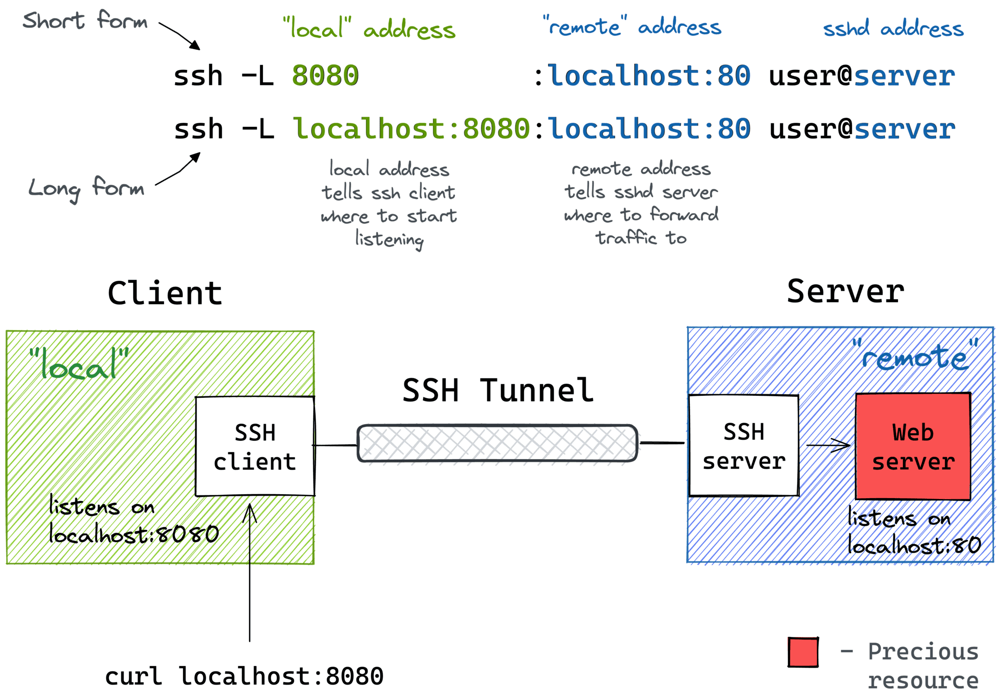
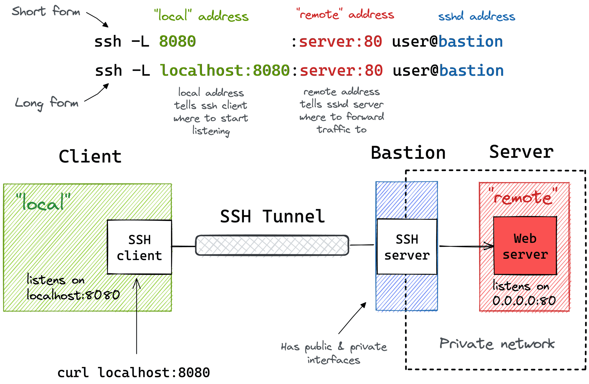

# K8sPlayground

## Subnet mask

The second item, which is required for TCP/IP to work, is the subnet mask. The subnet mask is used by the TCP/IP protocol to determine whether a host is on the local subnet or on a remote network.

## Incorrect subnet mask

If a network uses a subnet mask other than the default mask for its address class, and a client is still configured with the default subnet mask for the address class, communication will fail to some nearby networks but not to distant ones.

As an example, if you create four subnets (such as in the subnetting example) but use the incorrect subnet mask of 255.255.255.0 in your TCP/IP configuration, hosts won't be able to determine that some computers are on different subnets than their own. In this situation, packets destined for hosts on different physical networks that are part of the same Class C address won't be sent to a default gateway for delivery.

A common symptom of this issue is when a computer can communicate with hosts that are on its local network and can talk to all remote networks except those networks that are nearby and have the same class A, B, or C address. To fix this problem, just enter the correct subnet mask in the TCP/IP configuration for that host.

Suppose you have a Class C block: `192.168.1.0/24`.
You subnet it further into /26 (four subnets: .0, .64, .128, .192).
If a host at `192.168.1.10` is set with mask 255.255.255.0:
It thinks 1`92.168.1.70` (which is actually on a different subnet /26) is on its local LAN.
It ARPs for that host instead of sending the packet to the gateway.
Communication fails.

Using a subnet mask of `255.255.255.192`, your `192.168.123.0` network then becomes the four networks 1`92.168.123.0, 192.168.123.64, 192.168.123.128 and 192.168.123.192`. These four networks would have as valid host addresses:

`192.168.123.1-62 192.168.123.65-126 192.168.123.129-190 192.168.123.193-254`


`192.168.123.0/23`

`/23` combines two consecutive /24 networks:
192.168.123.0 – 192.168.123.255
192.168.124.0 – 192.168.124.255
So effectively, 192.168.123.0/23 is a single “supernet” that spans across both the 123.x and 124.x ranges.

Now the network is defined by address + prefix length, not by a class.

Block Size Formula
The size of each subnet is determined by the number of host bits:
Block size=2^ 
(host bits)
 
 So:
/24 → 8 host bits → block size = 2⁸ = 256 addresses
/25 → 7 host bits → block size = 2⁷ = 128 addresses
/26 → 6 host bits → block size = 2⁶ = 64 addresses

Each subnet starts at a multiple of the block size in the last “subnetted” octet.
Example: /25 (128 addresses each)
Block size = 128
Start at 0, then 128, then 256 (but since an octet only goes up to 255, we stop there).

So the subnets are:
192.168.123.0 – 192.168.123.127
192.168.123.128 – 192.168.123.255


```c
/*
 * Convert subnet address to binary representation
 */
if (inet_pton(AF_INET, subnet_addr_str, &subnet_addr4) == 1) {
    uint32_t subnet_mask = ntohl(subnet_addr4.s_addr);

    while (subnet_mask & 0x80000000) {
        plen++;
        subnet_mask <<= 1;
    }
} else {
    return -1;
}

return plen;

```

```c
#define MAX_PROCESSES	(1 << 14) /* /16 mask divided by /30 subnets */

static int inet_abc_len(__be32 addr)
{
	int rc = -1;	/* Something else, probably a multicast. */

	if (ipv4_is_zeronet(addr) || ipv4_is_lbcast(addr))
		rc = 0;
	else {
		__u32 haddr = ntohl(addr);
		if (IN_CLASSA(haddr))
			rc = 8;
		else if (IN_CLASSB(haddr))
			rc = 16;
		else if (IN_CLASSC(haddr))
			rc = 24;
		else if (IN_CLASSE(haddr))
			rc = 32;
	}

	return rc;
}


/* we convert netmask to bitmask and store it */
	if (set->family == NFPROTO_IPV4)
		bitmask.ip = ip_set_netmask(netmask);
```

What is an SSH Tunnel?
An SSH tunnel is a way to securely forward network traffic from one computer to another through an encrypted SSH connection. It allows you to access services (like databases, websites, or applications) running on a remote system (or even inside a private network) as if they were running on your local machine

1. Local Port Forwarding (most common)
You forward a local port to a remote destination.
Example: Connect to a remote database behind a firewall.
`ssh -L 5432:localhost:5432 user@remote-server`
Now, your local localhost:5432 talks to the remote server’s PostgreSQL port.

2. Remote Port Forwarding
You forward a remote port on the server to a local destination.
Example: Expose your local web app to someone via the remote server.
`ssh -R 8080:localhost:3000 user@remote-server`
Now, if someone visits remote-server:8080, they see your local app running on port 3000

3. Dynamic Port Forwarding (SOCKS proxy)
Creates a SOCKS proxy to tunnel arbitrary traffic.
Example: Route web browsing securely through the remote server.
`ssh -D 1080 user@remote-server`
Now, configure your browser to use localhost:1080 as a SOCKS proxy, and all browsing traffic routes via the server


Access a Remote MySQL Database

`ssh -L 3306:127.0.0.1:3306 user@remote-server`

Now, mysql -h 127.0.0.1 -P 3306 -u dbuser -p connects securely.


## Best Practices
Use SSH keys instead of passwords for security.
Use ~/.ssh/config for cleaner configs:
Host myserver
    HostName remote-server.com
    User myuser
    LocalForward 8080 localhost:80


## How an SSH Connection Works
An SSH session has four main phases:
1. TCP Connection
- SSH runs over TCP, default port 22.
- The client (ssh user@server) opens a TCP connection.
2. Handshake & Key Exchange
- Both client and server negotiate:
  - Which encryption algorithms to use (AES, ChaCha20, etc.).
  - Which key exchange method (Diffie–Hellman, ECDH, etc.).
- A shared secret is generated, never sent over the network (important for security).
- The server proves its identity with a host key (stored in `~/.ssh/known_hosts`).

This is why the first time you connect to a new server, SSH asks:
“Are you sure you want to continue connecting?”

3. Authentication
Now the client must prove its identity. Options:
- Password authentication → simplest but less secure.
- Public key authentication → the preferred method:
  - You generate a key pair (ssh-keygen).
  - Place your public key on the server (~/.ssh/authorized_keys).
  - When connecting, the server challenges the client.
  - The client proves it has the private key by signing data.
- Other methods exist too (Kerberos, certificates, hardware tokens).

4. Secure Channel Established
- Once authenticated, all data is:
  - Encrypted (using the negotiated cipher).
  - Integrity-protected (MACs ensure no tampering).
- Multiple channels can run inside one SSH connection:
  - A shell (bash, zsh)
  - File transfers (scp, sftp)
  - Port forwarding/tunnels

### Encryption Layers in SSH
- Symmetric encryption (AES, ChaCha20, etc.) → fast, used for bulk traffic.
- Asymmetric encryption (RSA, ECDSA, Ed25519) → used only during handshake/authentication.
- MACs (HMAC-SHA2, Poly1305) → detect tampering.

ngrok is a tunneling service that lets you expose a local service (like a web server running on localhost:3000) to the public internet using a temporary HTTPS (or TCP) URL.
Example:
`ngrok http 3000`
You get a public URL like https://abcd1234.ngrok.io → which forwards traffic securely to your local server.

### How ngrok Works Internally
-You run ngrok http 3000.
- ngrok client opens a persistent outbound connection to ngrok’s servers (usually over TLS).
- ngrok server assigns a public domain/port.
- Incoming requests hit ngrok.io.
ngrok forwards them down the secure tunnel back to your local port (localhost:3000).
- This avoids NAT/firewall issues since the connection originates from your computer (outbound is almost always allowed)


to understand tunneling, you need to know how networking ports works

SSH tunneling is a direct secure connection to another computer so you can control it
SSH  tunnel allows you to forward data from one port to another


### How SSH Uses Ports
SSH tunnels manipulate this concept:
Local Port Forwarding
You say: `“Bind localhost:8080 → forward to remotehost:80 via SSH.”`
Your browser connects to `localhost:8080`, but traffic is secretly carried over SSH to `remotehost:80`.


### Remote Port Forwarding
You say: `“Bind remotehost:9000 → forward to localhost:3000.”`
Someone connecting to `remotehost:9000` actually hits your local app on port `3000`.

### Dynamic Port Forwarding
You say: `“Create a SOCKS proxy on localhost:1080.”`
Any app can connect to that port, and SSH dynamically forwards traffic to arbitrary destinations.


### Why Ports Matter in Tunneling
Tunneling works because:
- Processes bind to ports (listening for connections).
- SSH can redirect ports → instead of connecting directly, the data goes into the SSH channel.
- On the other end, SSH re-establishes the TCP connection to the target port.
In short: `tunneling = port redirection over an encrypted channel`.

In local forwarding (-L), the port opens on the client side.
In remote forwarding (-R), the port opens on the server side.

# Cloudflare Tunnels
To enable clientless access to your applications, you will need to create a Cloudflare Tunnel that publishes applications to a domain on Cloudflare. A published application creates a public DNS record that routes traffic to a specific address, protocol, and port associated with a private application. For example, you can define a public hostname (`mywebapp.example.com`) to provide access to a web server running on `https://localhost:8080`. When a user goes to `mywebapp.example.com` in their browser, their request will first route to a Cloudflare data center where it is inspected against your configured security policies. Cloudflare will then forward validated requests down your tunnel to the web server.


## Outbound-only connection

Cloudflare Tunnel uses an outbound-only connection model to enable bidirectional communication. When you install and run cloudflared, cloudflared initiates an outbound connection through your firewall from the origin to the Cloudflare global network.

Once the connection is established, traffic flows in both directions over the tunnel between your origin and Cloudflare. Most firewalls allow outbound traffic by default. cloudflared takes advantage of this standard by connecting out to the Cloudflare network from the server you installed cloudflared on. You can then configure your firewall to allow only these outbound connections and block all inbound traffic, effectively blocking access to your origin from anything other than Cloudflare. This setup ensures that all traffic to your origin is securely routed through the tunnel.

`ssh -R 8080:localhost:80 user@remotehost`
This makes `sshd` listen on TCP port 8080 of the remote machine.

The Linux kernel’s TCP/IP stack delivers packets destined for `<remotehost-ip>`:8080 to whichever process bound that port.
In this case, that process is sshd

If a firewall (iptables/nftables) is blocking port 8080, the packets never reach `sshd`.
If allowed, the kernel hands them to sshd via the normal socket API.

`ssh -L 8080:remotehost:80 user@ssh-server`
- the SSH client process `ssh` is listening on `localhost:8080`.
- So if you point your browser at `http://localhost:8080`, it connects to the SSH client, not a real web server

`Local port forwarding (-L) always binds a port on the client side.Local port forwarding (-L) always binds a port on the client side.`

## How Connections Work by Default
- On the public internet, servers usually have public IP addresses (reachable from anywhere).
- Most client machines (laptops, desktops) are behind NAT (home routers, corporate firewalls, ISP carrier-grade NAT).
- NAT/firewalls block unsolicited inbound connections — so remote machines usually cannot open a connection directly to your laptop.
That’s why in practice:
- You can SSH out to a server (because outbound traffic is allowed).
- But the server can’t usually SSH in to your laptop (blocked by NAT/firewall).

with everse SSH tunneling,your laptop initiates the outbound SSH connection (NAT-friendly).


`ssh -D 1080 user@remote-server`

- The SSH client opens a `SOCKS` proxy on your local machine at port 1080.(Your SSH client binds to localhost:1080.)
- It speaks the SOCKS protocol (usually SOCKS5).
- Applications (like browsers) can be configured to use that `SOCKS` proxy.
- Instead of forwarding one fixed host/port (like -L or -R), it dynamically forwards traffic to any destination you request, decided at runtime.

Now when you visit http://example.com:
- Browser sends request to SOCKS proxy.
- SSH client tells sshd to connect to example.com:80.
- Data flows through the tunnel.
- To example.com, it looks like the request came from the remote server’s IP


The foo.mycompany.com server must allow port forwarding (see AllowTcpForwarding in /etc/ssh/sshd_config)

AllowTcpForwarding yes|no|local|remote`
- `yes → forwarding is allowed (default in many setups).
- no → completely disable -L, -R, and -D.
- local → only allow -L.
- remote → only allow -R


`ssh -R 8080:localhost:3000 user@foo.mycompany.com` 
- `foo.mycompany.com` opens port 8080.
- Any connection to `foo.mycompany.com:8080` is tunneled back to your home machine’s localhost:3000.

`ssh -L 3306:db.mycompany.com:3306 user@foo.mycompany.com`

`mysql -h 127.0.0.1 -P 3306 -u dbuser -p`


With SSH Tunnels, ou can achieve the following:

- Access internal VPC endpoints through a public-facing EC2 instance.
- Open a port from the localhost of a development VM in the host's browser.
- Expose any local server from a home/private network to the outside world.


## Local Port Forwarding

[ssh-tunnels](https://iximiuz.com/en/posts/ssh-tunnels/)

`ssh -L [local_addr:]local_port:remote_addr:remote_port [user@]sshd_addr`

The `-L` flag indicates we're starting a local port forwarding. What it actually means is:

- On your machine, the SSH client will start listening on `local_port` (likely, on `localhost`, but it depends - check the GatewayPorts setting).
- Any traffic to this port will be forwarded to the `remote_private_addr:remote_port` on the machine you SSH-ed to.


## Local Port Forwarding with a Bastion Host

t might not be obvious at first, but the ssh `-L` command allows forwarding a local port to a remote port on any machine, not only on the SSH server itself. Notice how the `remote_addr` and `sshd_addr` may or may not have the same value:



I often use the above trick to call endpoints that are accessible from the bastion host but not from my laptop (e.g., using an EC2 instance with private and public interfaces to connect to an OpenSearch cluster deployed fully within a VPC).

## Remote Port Forwarding
`ssh -R [remote_addr:]remote_port:local_addr:local_port [user@]gateway_addr`

`By default, the above SSH tunnel will allow using only the gateway's localhost as the remote address`. In other words, your local port will become accessible only from the inside of the gateway server itself, and highly likely it's not something you actually need. For instance, I typically want to use the gateway's public address as the remote address to expose my local services to the public Internet. For that, the SSH server needs to be configured with the `GatewayPorts yes` setting.

[ssh-tunneling-explained](https://goteleport.com/blog/ssh-tunneling-explained/)

`SSH tunneling entails transporting an additional data stream within exisitng ssh session`

SSH tunneling is a method to transport additional data streams within an existing SSH session.

### What is an Ingress Gateway Server?
- An ingress gateway server is a machine (or cluster of machines) that:
Receives external client requests (HTTP, HTTPS, TCP, etc.).
- Applies security/policies (TLS termination, authentication, rate limiting, WAF rules).
- Routes traffic to the correct internal service (usually behind private IPs, not directly exposed).
Think of it as the front door into your private network or Kubernetes cluster.

1. Classic Networking
A bastion host is for SSH,
An ingress gateway is for application traffic (HTTP, TCP, gRPC, etc.).
Example: An Nginx or HAProxy server listening on port 443 and forwarding requests into your app servers.
2. Kubernetes
Kubernetes has the concept of an Ingress Controller, which is implemented by an Ingress Gateway.
Example: Istio’s istio-ingressgateway pod, or Nginx Ingress Controller.
It exposes a public IP/hostname and routes incoming requests to the correct Kubernetes services inside the cluster.


## What a Bastion Host Adds Beyond Firewalls
1. Centralized Entry Point
Without a bastion: every server needs firewall rules, SSH key management, and user auditing individually.
With a bastion: only the bastion is exposed. Internal servers can have SSH locked down to AllowUsers bastion-user or iptables -s bastion-ip -p tcp --dport 22 -j ACCEPT.
Easier to maintain and review.
2. Audit and Logging
Firewalls don’t log commands — they only log connections.
A bastion can record:
Which user logged in.
Session logs (keystrokes, commands, even session replay in advanced setups).
Critical for compliance (PCI, SOC2, HIPAA).
3. User Management
With iptables, access is tied to IP ranges — which is weak (IP spoofing, shared NATs, etc.).
A bastion ties access to user identity (SSH keys, MFA, SSO integration).
Easier to revoke one person’s access without touching every server’s firewall.
4. Additional Security Layers
Bastions are typically hardened:
MFA required.
Intrusion detection/IPS.
Session timeout and monitoring.
They can enforce things iptables alone can’t (like forcing use of ssh-agent, restricting file copy, disabling root login, etc.)
5. Operational Simplicity
Imagine 500 servers.
Managing iptables rules and user SSH keys across all of them is painful.
With a bastion: one public entry point → one set of access policies.


### Understanding SSH Tunnels

SSH tunnels, also known as SSH port forwarding, allow you to create a secure channel between your local computer and a remote server. This channel can be used to relay traffic, bypassing firewalls or accessing services that are not directly accessible.

SSH tunnels encrypt your data as it travels through the tunnel, providing an additional layer of security. This is particularly useful when accessing services over unsecured networks or when you need to bypass network restrictions.


 Secure Browsing with SOCKS Proxy (Dynamic Port Forwarding)

Scenario: You’re using a public Wi-Fi and want to secure all your browser traffic by routing it through an SSH tunnel.

[SSH-Tunnels](https://github.com/tecnico-sec/SSH-Tunnels?tab=readme-ov-file)

```sh
# localhost because the destination resource is the SSH server itself
ssh -f -N -L 12345:localhost:23 user@192.168.64.4
```

- `ssh user@192.168.64.4`:
Connect to the SSH server at 192.168.64.4 as user.
- `-L 12345:localhost:23` (local port forward)
On your machine (the client), open TCP port 12345 on 127.0.0.1.
- Any connection to localhost:12345 on your machine is forwarded, through the SSH tunnel, to localhost:23 as seen from the SSH server (i.e., the server itself, port 23).
localhost:23 on the server is typically telnet.
- So, effectively: your_pc:12345 →(SSH)→ server:localhost:23.
 `-N`: Don’t run a remote command; just keep the tunnel open.
  `-f`: Go to the background after authentication (daemonize the tunnel).


## SSH with TUN/TAP

`ssh -w <local_tun>:<remote_tun> user@server`

This sets up a `point-to-point` tunnel between a TUN/TAP interface on the client and one on the server.
`-w 0:0` → create `tun0` locally and `tun0` remotely, and connect them.
Requires root or CAP_NET_ADMIN on both sides (because you’re creating network devices).
Requires enabling in `sshd_config` on the server:
`PermitTunnel yes`

### Simple IP-over-SSH Tunnel (TUN)
#### On the client
- sudo ssh -w 0:0 user@server
Then configure interfaces
```sh
sudo ip addr add 10.0.0.1/30 dev tun0
sudo ip link set tun0 up
```
#### On server:
```sh
sudo ip addr add 10.0.0.2/30 dev tun0
sudo ip link set tun0 up
```

Now you have a `/30` point-to-point link:
Client IP = 10.0.0.1
Server IP = 10.0.0.2
You can now ping `10.0.0.2` from the client, and packets flow encrypted over SSH.


What is SSH port forwarding used for?

SSH port forwarding is a powerful networking technique that creates encrypted tunnels for secure data transmission across networks. It enables users to bypass restrictive firewalls, securely access remote databases, facilitate remote debugging sessions, and protect sensitive information during transmission. This feature is particularly valuable for developers, system administrators, and security professionals who need to securely access remote services, manage distributed systems, or establish secure communication channels between different network segments while maintaining data confidentiality and integrity.
What’s the difference between local and remote port forwarding?

Local port forwarding (-L) establishes a secure tunnel from your local machine to a remote server, effectively allowing you to access remote services as if they were running on your local machine. This is ideal for accessing remote databases or web applications. Remote port forwarding (-R) operates in the opposite direction, creating a tunnel that enables external connections to reach services running on your local machine through the SSH server. This is particularly useful for exposing local development servers to the internet or allowing remote access to local resources, making it valuable for testing and development scenarios.
How do I use SSH dynamic port forwarding?

Dynamic port forwarding (-D) creates a versatile SOCKS proxy that can handle multiple simultaneous connections through a single SSH tunnel. To implement this, use the command ssh -D 1080 user@server to establish a proxy on port 1080. Once configured, you can set up your applications (web browsers, development tools, or any SOCKS-compatible software) to route their traffic through this proxy. This creates a secure, encrypted pathway for all your application traffic, effectively providing a VPN-like experience for individual applications while maintaining the flexibility to choose which applications use the secure tunnel.
Is SSH port forwarding secure?

SSH port forwarding provides robust security through comprehensive end-to-end encryption of all forwarded traffic. The connection is protected by SSH’s industry-standard encryption protocols, including AES, making it highly secure for transmitting sensitive data. However, maintaining this security requires proper configuration, including strong authentication methods, regular security updates, and careful management of access permissions. It’s crucial to monitor for potential security vulnerabilities, implement proper access controls, and ensure that the SSH server is configured according to security best practices to maintain the integrity of the forwarded connections.

### Can I forward multiple ports in a single SSH connection?

Yes, SSH allows you to forward multiple ports simultaneously through a single SSH connection by specifying multiple -L or -R options in your command. For example: `ssh -L 8080:localhost:80 -L 5433:localhost:5432 user@server`. This capability is particularly efficient for managing multiple services through a single secure tunnel, reducing the overhead of maintaining multiple SSH connections. You can forward any combination of local and remote ports, making it possible to access various services (web servers, databases, development servers) through a single encrypted connection, which is both convenient and resource-efficient.
How do I troubleshoot SSH port forwarding issues?

[spam-ssh-tunnel](https://www.rackaid.com/blog/spam-ssh-tunnel/)


### Attacker’s machine
- Opens `localhost:2000` on their system.
-Configures SSH local port forwarding so that traffic sent to `localhost:2000` gets carried over SSH.
[ssh](https://docstore.mik.ua/orelly/networking_2ndEd/ssh/ch09_02.htm)

### SSH tunnel
- The attacker connects via SSH to a target server.
- The -L option (local port forward) is used:
`ssh -L 2000:127.0.0.1:23 user@target`
or in this case targeting SMTP (port 25).
- Effect: connections to the attacker’s `localhost:2000` are tunneled to `127.0.0.1:25` on the target server.

### Target server
- Runs an SMTP service (mail server) bound to `127.0.0.1:25` (only local connections allowed).
- Normally this service isn’t reachable externally.
### Abuse
- Attacker sends email via localhost:2000.
- Traffic goes through SSH → target server’s localhost SMTP port.
- The target server sends out the email.
- Now spam comes “from” the target server (trusted IP), not the attacker.

- SSH tunneling is powerful but dangerous if misconfigured.
If users on a system can forward ports, they can potentially:
  - Expose internal-only services (DBs, SMTP, Redis, etc.) to themselves.
  - Abuse them (spam, data exfiltration, lateral movement).
That’s why admins sometimes disable forwarding in `/etc/ssh/sshd_config`:
`AllowTcpForwarding no`

## What is Anycast?
- Normally, with Unicast, one IP = one server/location.
  - With Anycast, one IP = many servers around the world.
  - Routers automatically direct you to the nearest / lowest-latency server that advertises that IP.
- So when your DNS points `api.domain.com` → 203.0.113.1 (an Anycast IP):
  - A user in Tokyo is routed to the Tokyo edge POP.
  - A user in Paris is routed to the Paris edge POP.
  - Same hostname, same IP, different physical edges


## How CDNs use it
- Edge network
  - CDNs advertise their Anycast IPs from hundreds of data centers worldwide.
  - BGP (Border Gateway Protocol) ensures each client hits the “closest” edge (network-wise, not just geography).
- Latency reduction
  - TLS handshake happens at the nearest edge.
  - For static content, the edge may serve from cache immediately.
  - For dynamic content/APIs, the edge forwards via CDN’s optimized backbone to your origin.
- Failover & resilience
  - If one POP goes down, BGP routes traffic to the next best POP automatically.
  - This gives built-in DDoS resilience and high availability.

### What is an ASN?
- The internet is made up of thousands of independent networks: ISPs, CDNs, cloud providers, universities, enterprises.
- Each of these networks is called an Autonomous System (AS): a group of IP prefixes (blocks) under a single routing policy.
- An Autonomous System Number (ASN) is the unique identifier for that network in BGP (Border Gateway Protocol).

## How it works
- When two networks connect, they use BGP to exchange routes.
- The ASN is announced along with the IP prefix, so other routers know which network a route belongs to.
Example:
```sh
Prefix: 203.0.113.0/24
Origin ASN: 65000
```
- Routers look at the AS-path (the chain of ASNs a route passed through) to decide the best path

### Types of ASNs
Public ASNs (allocated by RIRs like ARIN, RIPE, APNIC):
Used when your network connects to the global internet.
Range: 1–64,495 (and also 4-byte ASNs up to ~4.2 billion).
Private ASNs:
For internal BGP inside organizations (not advertised globally).
Range: 64,512–65,534 and 4,200,000,000–4,294,967,294.

`Anycast → multiple POPs advertise the same prefix from the same ASN, and BGP routes traffic to the closest one.`


```sh
whois 1.1.1.1 | grep origin

origin:         AS13335

```
```sh
whois -h whois.radb.net 1.1.1.0/24

route:          1.1.1.0/24
origin:         AS13335
descr:          APNIC Research and Development
                6 Cordelia St
mnt-by:         MAINT-APNICRANDNET
last-modified:  2023-04-26T02:42:44Z
source:         APNIC
rpki-ov-state:  valid

route:          1.1.1.0/24
descr:          QRATOR via EMIX
origin:         AS13335
mnt-by:         MAINT-AS8966
changed:        noc@emix.net.ae 20230803
source:         RADB
last-modified:  2023-11-13T16:17:56Z
rpki-ov-state:  valid
```

```sh
whois -h whois.cymru.com " -v 1.1.1.1"

AS      | IP               | BGP Prefix          | CC | Registry | Allocated  | AS Name
13335   | 1.1.1.1          | 1.1.1.0/24          | AU | apnic    | 2011-08-11 | CLOUDFLARENET, US
```


https://github.com/marketplace/actions/hashicorp-setup-terraform
https://github.com/marketplace/actions/docker-login

https://github.com/marketplace/actions/azure-login

https://github.com/marketplace/actions/github-action-for-flyctl


`mkdir -p .github/workflows && touch .github/workflows/build.yml`