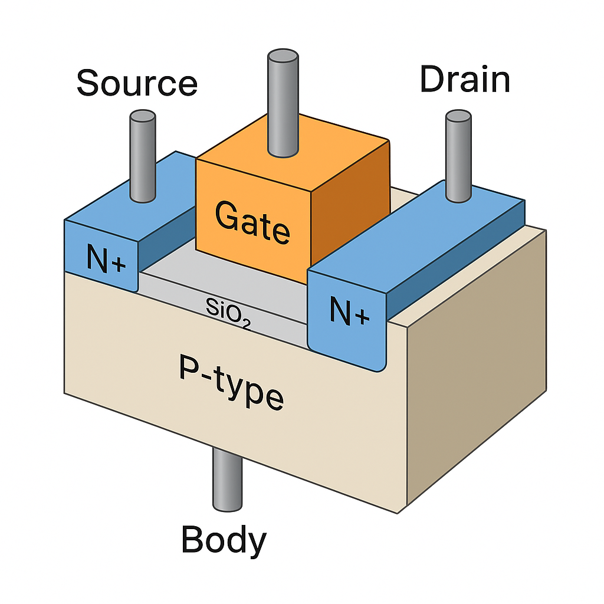
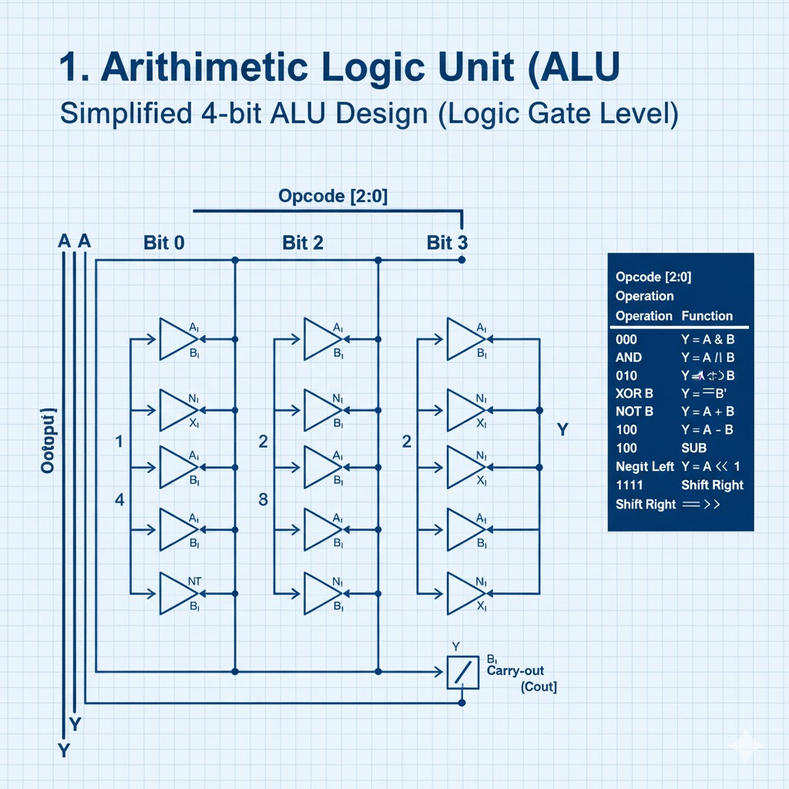
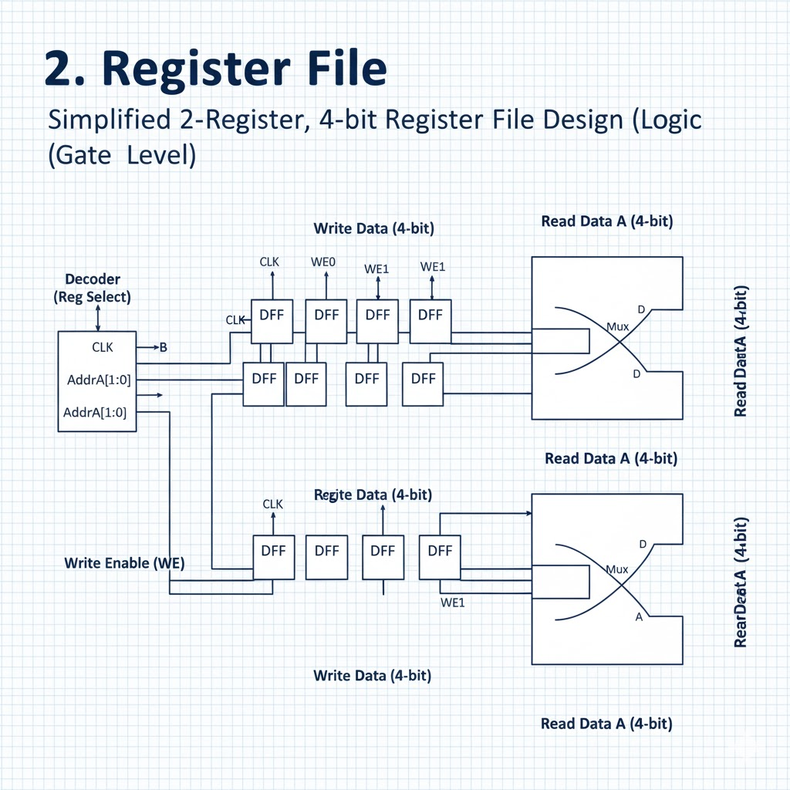

The cpu doesn't control IO devices, it communicates with them

each IO device has its microcontroller so the cpu doesn't waste  cycles 

- control bus( hardware or physical connection)
- address bus
- data bus

The control bus is used to send both commands and data

when designing Io, there are two things we need to think about
- Communication method: how the cpu physically talks to devices. 
implementation 
  - Memory-Mapped IO
  - Port-Mapped IO(isolated IO)
- Data transfer technique: how and when the data moves
  - Programmed IO( Polling)
  - Interupt-Driven IO

  The hardware can use any combination of implementaions


  NAND is a universal gate → you can build any logic circuit using only NANDs.

A bus is simply a set of parallel wires (or connections) that carry specific types of information inside or between chips.
```sh
Bus Type	Purpose	Example Signals
Address Bus	Carries memory addresses — where data should go	A₀–A₁₅, etc.
Data Bus	Carries the actual data values	D₀–D₇ (for 8-bit), D₀–D₃₁ (for 32-bit)
Control Bus	Carries coordination signals	Read/Write (R/W), Clock, Interrupt
```


### Data Bus
- Transfers actual data between the CPU, memory, and peripherals.
- Usually bidirectional, meaning data can move both to and from the CPU.
- The number of bits it can carry at once — for example, a 32-bit data bus can transfer 32 bits (4 bytes) of data simultaneously.
- A wider data bus means faster data transfer and higher performance.

### Address Bus
- Carries the addresses of data (memory locations) the CPU wants to read or write.
- Unidirectional — from CPU to memory or I/O.
- Determines how much memory the CPU can access.
- A 32-bit address bus can access 
2^32 = 4 GB of memory

a 32-bit address bus means there are 32 separate physical lines (wires) used to carry the address signal.

Since there are 32 wires, the CPU can represent 
`2^32` different combinations of 0s and 1s.
`2^32 =4,294,967,296` unique addresses
If each address refers to 1 byte of memory, that equals 4 GB of addressable memory space.

A 32-bit CPU is a processor whose internal architecture is designed to handle data, addresses, and instructions that are 32 bits wide

- Registers Are 32 Bits Wide
Registers are tiny, high-speed storage locations inside the CPU where data and instructions are processed.
Each register in a 32-bit CPU holds 32 bits (4 bytes).
That means the CPU can operate directly on 32-bit numbers in a single instruction

Example:
A 32-bit CPU can add two 32-bit numbers in one go, but if you give it a 64-bit number, it must process it in parts (two operations).

- Address Bus Width — 32 Bits
Usually, a 32-bit CPU also has a 32-bit address bus, meaning it can generate 
2^32 =4,294,967,296 unique memory addresses.
Each address points to 1 byte, so it can directly access 4 GB of memory.
This is why older systems (like 32-bit Windows) couldn’t use more than about 4 GB of RAM

## Data Bus Width — 32 Bits
The data bus is also 32 bits wide. This means:
The CPU can read or write 4 bytes of data to/from memory in one operation.
Wider buses → more data transferred per clock cycle.

- Instruction Set Architecture (ISA)
A “32-bit CPU” also means its instruction set (the language the CPU understands) uses 32-bit wide instructions, registers, and addressing modes.

### so what happens when you try to add a 64 bits number?
Inside a 64-Bit CPU
When you have a 64-bit processor, it has:
64-bit registers (e.g., RAX, RBX in x86-64)
A 64-bit ALU (Arithmetic Logic Unit) — the part that performs addition, subtraction, etc.
So, if you tell it to add two 64-bit numbers, the CPU can do it in a single clock cycle, like this:

```sh
RAX = 0x00000001FFFFFFFF
RBX = 0x0000000000000001
ADD RAX, RBX

```


### Can you store a 64 bit in a 48 bit address?

So the address width doesn’t limit the size of individual data values — it limits how many places in memory the CPU can reach
`You can absolutely store a 64-bit number in memory, even if the CPU only has 48 address bits`


### How That Works in Practice
A 64-bit number occupies 8 bytes of memory.
Each address points to one byte.
If your CPU has 48-bit addresses, it can address 
`2⁴⁸`= 256 TB worth of bytes.
So within that 256 TB of space, each address can point to the first byte of your 64-bit number.
The rest of the bytes are stored in the following consecutive memory addresses

A single 64-bit number spans 8 consecutive memory addresses.
So you need 8 unique addresses to store all 8 bytes of that number.

Modern computers use byte-addressable memory, meaning:
Every unique address identifies one byte of data.

So if you have `N` bits of address lines (wires), you can create 2^N unique combinations of 0s and 1s — and therefore 

Each address corresponds to 1 byte, so the total amount of addressable memory is 
2^Nbytes.

### Apply That to 48 Bits
If the CPU has 48 address lines, the total number of unique addresses is:
`2⁴⁸=281,474,976,710,656`
That’s 281 trillion addresses — each pointing to one byte.
So the total addressable memory is:
`2⁴⁸` bytes of memory.

### Convert Bytes to Terabytes
Now, let’s convert that number into more familiar units:
2^48bytes=2^48−40 terabytes=256 TB.
That’s because:
2^10bytes =1 KB
2^20 bytes= 1 MB
2^30 bytes= 1 GB
2^40 bytes = 1 TB

So subtracting exponents:
48−40 = 8
      = 2^8
      =256
2^48 bytes=256 TB

The CPU can generate `2⁴⁸`different memory addresses,
and each address corresponds to exactly 1 byte of memory.

`the instruction set (the language that a processor understands) is created and defined by the CPU manufacturer or architecture designer.`

The logic circuits themselves — built from millions or billions of transistors — are designed to recognize, decode, and execute each instruction.
That behavior is physically built into the silicon during manufacturing.

Every instruction (like ADD, MOV, JUMP) corresponds to a hardware circuit that can perform that function.
Inside the chip, you’ll find hardware blocks such as:
- Instruction Decoder – interprets binary opcodes
- Arithmetic Logic Unit (ALU) – performs math and logic operations
- Control Unit – orchestrates timing and data movement
- Registers & Caches – temporary storage
- Bus Interface Units – handle communication
Each of these blocks is made up of millions of transistors connected in a precise pattern etched into silicon.
When the CPU sees a binary instruction (say 10001011), the decoder’s transistor network automatically routes signals to the correct parts of the chip — because it’s physically wired to do so.

A guitar isn’t storing the notes — its strings, frets, and body are built to produce specific sounds when you play it.
Similarly, a CPU isn’t storing its instructions — its transistors and logic gates are built to produce the right electrical responses when an instruction is executed

So when the CPU executes an instruction like:
`MOV AL, [0x0010]`
what really happens is:
The CPU puts `0x0010` (binary 0000000000010000) onto the address bus.
The control bus signals a read operation.
The memory chip at that address sends the stored data back on the data bus.
The CPU reads that data into its register (in this case, AL).

What Is an Instruction Set Architecture?

An Instruction Set Architecture (ISA) is part of the abstract model of a computer that defines how the CPU is controlled by the software. The ISA acts as an interface between the hardware and the software, specifying both what the processor is capable of doing as well as how it gets done.

The ISA provides the only way through which a user is able to interact with the hardware. It can be viewed as a programmer’s manual because it’s the portion of the machine that’s visible to the assembly language programmer, the compiler writer, and the application programmer.

The ISA defines the supported data types, the registers, how the hardware manages main memory, key features (such as virtual memory), which instructions a microprocessor can execute, and the input/output model of multiple ISA implementations.


Instruction register: Holds the program instruction that is currently being executed

each instruction includes a fixed number of bits to represent the operation such as add, substract,load or store(operation code). There is also a fixed number of bits to identify the operand or operands, that will be operated  upon.An operand could be a value, a cpu register or memory address.For a given sized instructor register,the more bits are allocated to the operation code, then the more commmands are availabe; the machine can have a larger instruction set. A richer instruction set means that fewer bits are avaible  for the operand, which means that fewer memory locations can be accessed directly. Converseldy, if fewer bits are used for the operation code, then there will be fewer types of instructions available but more bits avaialble for the memory address

`You use 48 address wires to pick the location, and 64 data wires to send the value`

So even though the CPU only has 48 address lines, it can:
Choose one of 2^48 possible byte addresses (256 TB space),
And write 64 bits (8 bytes) at that address in one operation.

the address bus is unidirectional.

The CPU is the only component that generates addresses — it tells the memory or device where to read or write data

A CPU never works with one bus alone.
Every data transfer involves three buses working together:
Bus	Role	Direction
Address Bus	Specifies where to read/write	CPU → Memory/I/O
Data Bus	Carries the actual data	CPU ↔ Memory/I/O
Control Bus	Coordinates when and how the transfer happens	Bidirectional
T`hey work together in synchronized steps controlled by the CPU’s clock.`

### Step-by-Step Coordination (Example: Read Operation)
- CPU Puts the Address on the Address Bus
`MOV RAX, [0x0000_0000_1000]`
It places the address `0x1000` on the address bus.
- CPU Sends Control Signal
The CPU activates the READ line on the control bus.
- Memory Decodes the Address
- Memory Places Data on the Data Bus
Memory retrieves the stored data (for example `0xAB`)
and places it on the data bus.
- CPU Reads the Data
The CPU reads that value from the data bus and stores it in a register (like `RAX`).


### Coordination for a Write Operation

- Address Bus
CPU puts the target address
- Data Bus
CPU puts data value to write
- Control Bus
CPU activates WRITE signal
- Memory stores the incoming data at the address

All of this is controlled by the CPU clock — each step happens in specific clock cycles

The control bus carries command and timing signals that coordinate all activities between:
- The CPU
- Memory
- Input/Output (I/O) devices

The program counter holds the address of the next instruction to be executed
Instruction register holds the address of the instruction we are currently executing

Fetch reads the memory location the program counter points to and store that data into the instruction pointer

The number of address lines (address bus width) directly depends on how much memory your CPU is designed to access.


## Mosfet
- It can turn current ON or OFF
- It can amplify signals
- It’s controlled by an electric field, not by direct current flow
That’s why it’s called a field-effect transistor (FET).
Letter	Meaning	Role
M	Metal	Gate electrode (now polysilicon in modern chips)
O	Oxide	Thin insulating layer (usually silicon dioxide, SiO₂)
S	Semiconductor	Usually silicon — where current flows
So a MOSFET has four terminals:
Gate (G) — control terminal
Source (S) — where electrons enter
Drain (D) — where electrons leave
Body (B) — substrate (often tied to source)

The Core Idea: Voltage Controls Current
That’s the essence of the MOSFET.
A small voltage at the Gate controls a much larger current between Source and Drain.
The Gate doesn’t touch the semiconductor directly — it’s separated by an insulating oxide.
This means the Gate current is almost zero — it controls current electrostatically.

The MOSFET uses an electric field (from the gate voltage) to control whether current can flow between source and drain.

The core idea of the MOSFET is that a voltage-controlled electric field can create or destroy a conducting channel in a semiconductor — turning current ON or OFF with almost no power.

It should be possible to control the supply of electrons near the surface of a semi conductor by influencing them with an electric field imposed from the outside

### Diode
A diode is an electronic component that allows current to flow in one direction but blocks it in the other

A diode is formed by joining two regions of semiconductor material:
Side	Doping Type	Charge Carriers	Role
P-type	Has holes (missing electrons)	Positive	Anode
N-type	Has extra electrons	Negative	Cathode
At the junction of these two materials, something important happens:
Electrons from the N-side move toward the P-side.
Holes from the P-side move toward the N-side.
They meet and recombine, forming a depletion region — an area with no mobile charge carriers.
This depletion region acts like an insulating barrier that stops current flow — unless you apply the right voltage.


### Forward Bias (ON)
When you connect the P-side to positive voltage and the N-side to negative:
The external voltage pushes electrons and holes toward the junction.
The depletion region shrinks.
Current can now flow easily through the diode.
💡 Once the forward voltage reaches about 0.7 V for silicon (or 0.3 V for germanium), the diode turns ON and conducts current

Current direction: Anode → Cathode

#### Reverse Bias (OFF)
When you connect the P-side to negative and N-side to positive:
The external voltage pulls charge carriers away from the junction.
The depletion region widens.
The diode becomes a strong insulator — almost no current flows (only a tiny leakage current).
 No current flows under normal conditions.

 [cpu](https://medium.com/@razvanbadescu/anatomy-of-a-cpu-bc02cd950cca)

 A standard D-type flip-flop can be logically projected using 4 NAND or 4 NOR gates. Since a standard NOR or NAND gate requires 4 transistors (in CMOS technology: 2 nMOS and 2 pMOS), a standard data flip-flop contains 16 transistors

 The opcode is data, but it’s interpreted by hardware logic that knows what each pattern of bits means.

how it works in real hardware:
- Fetch: The CPU loads the opcode from memory into the Instruction Register (IR).
- Decode: The Instruction Decoder (a hardware circuit of gates, PLA, or microcode ROM) examines the opcode bits.
- Execute: The decoder activates control lines:
  - To the ALU (Add, Subtract, etc.)
  - To registers (read/write)
  - To the memory interface
  - To the program counter


Type	Terminals	Symbolic Meaning
NPN / PNP (BJT)	Base (B), Collector (C), Emitter (E)	Controls current flow from collector to emitter using base current
nMOS / pMOS (FET)	Gate (G), Drain (D), Source (S)	Controls current flow from drain to source using gate voltage

A small change in base current (Iᴮ) → causes a large change in collector current (Iᶜ).

That ratio is the current gain (β or h_FE):

Iᶜ=β⋅Iᴮ
​	
 
So if β = 100, then a tiny 10 µA base current controls a 1 mA collector current.
The transistor is amplifying the signal!


A MOSFET also has three terminals:
- Gate (G) — input
- Drain (D) — output
- Source (S) — reference
Here, a small change in gate voltage (V_GS) controls the current from drain to source (I_D).

```sh
I D​=k(VGS​−VT​)2
```
(where VT= threshold voltage)
Principle:
- The gate draws almost no current (it’s insulated by SiO₂).
- But changing the gate voltage changes the electric field in the silicon channel.
- That field controls how many electrons can flow between drain and source.

When you apply electricity (voltage) across an insulator, it doesn’t conduct current, but it does create an electric field inside the material.
That electric field is actually what makes transistors work, even though their key layer — the oxide — is an insulator.

- The positive side attracts electrons toward it.
- The negative side pushes electrons away.
- Because the insulator doesn’t conduct, the electrons can’t cross through —
but they do rearrange on each surface.
- This separation of charge creates an electric field (E) inside the insulator:
E= V/d

where
V = applied voltage,
d = thickness of the insulating layer.
So even though no significant current flows, an electric field exists within the insulator — energy is stored in it, just like in a capacitor​	

In a MOSFET (Metal-Oxide-Semiconductor Field Effect Transistor):
- The Gate terminal is separated from the silicon by a thin oxide layer (SiO₂).
- That oxide is an insulator — no current flows through it.
But when you apply a voltage to the gate, it creates an electric field across the oxide.
- This electric field penetrates into the semiconductor below and attracts or repels charge carriers (electrons or holes).
That’s why it’s called a Field Effect transistor —
the electric field generated through the insulating layer controls the flow of current in the semiconductor channel underneath


```sh
      +Vgate
        │
        │  Electric Field (E)
        ▼
   ┌──────────────┐
   │  Metal Gate  │  ← conductor
   ├──────────────┤
   │  SiO₂ Layer  │  ← insulator (no current, but field passes)
   ├──────────────┤
   │ Silicon Base │  ← semiconductor (field controls carriers here)
   └──────────────┘
```

- The gate voltage induces a charge in the silicon surface.
- That creates or removes a channel through which current can flow between the source and drain.
- The oxide remains insulating, but the electric field passes through it.

A capacitor is literally just:
- Two conductive plates,
- Separated by an insulator (the dielectric).
When voltage is applied:
- Charges build up on the plates,
- An electric field forms inside the dielectric,
- No current flows continuously,
But energy is stored in that field.
The gate oxide in a MOSFET is basically a microscopic capacitor between the gate and the channel

### An Electric Field = Stored Potential Energy
An electric field exists whenever charges are separated — for example, when you have:
A positive charge here (+)
A negative charge there (−)
The space between them isn’t “empty” — it’s filled with an electric field, which represents stored potential energy.
That field stores energy because it takes work to separate those charges against their natural attraction
 

for a charged capacitor:
The metal plates hold the charges,
The space between (and the dielectric inside) holds the energy.
That’s why the formula for energy density depends on E (field strength), not on how many charges are there

A capacitor resists changes in voltage and can temporarily supply or absorb current. 

Silicon’s band gap energy is about:
Eg=1.12eV
That’s the energy difference between:
The valence band (where electrons are bound in covalent bonds), and
The conduction band (where electrons can move freely).
At low temperatures, almost no electrons can cross that gap.
But as temperature increases:
More electrons get enough thermal energy to jump the gap.

Each time an electron jumps to the conduction band, it leaves behind a hole in the valence band —
and both can carry current:
Electrons move through the conduction band.
Holes move through the valence band.
So conductivity increases dramatically with temperature

Each freed electron creates:
- One electron in the conduction band,
- One hole in the valence band.
Now both can move if an electric field is applied — producing current.
At higher temperatures:
There are more free carriers,
So resistance drops (opposite of metals).
That’s a key difference between semiconductors and metals

The goal is to drastically increase and control the number and type of charge carriers — without needing to heat the material too much.
So instead of waiting for thermal energy to free electrons randomly, we intentionally add atoms that donate or accept electrons

Pure silicon (intrinsic) has equal numbers of:
Electrons (n) in the conduction band, and
Holes (p) in the valence band.

Their product is constant:
ni2=n⋅p

When we dope it:
We can increase one type of carrier by factors of 10⁶–10¹⁸,

That gives us two distinct materials:
- n-type silicon — electrons dominate
Majority carriers: electrons (negative)
Minority carriers: holes (positive)
- p-type silicon — holes dominate
Majority carriers: holes (positive)
Minority carriers: electrons (negative)


So doping gives us room-temperature conductivity, precise carrier control, and stable devices — something heat alone can’t achieve


a process can create many threads, but there are only a limited number of cores available to execute them simultaneously.


The transistor works by injecting carriers (electrons or holes) from the emitter into the base, then collecting them at the collector.

For this to work:
- The emitter injects carriers of a particular type (say, electrons in an NPN).
- The collector must be ready to collect the same type of carriers (electrons).
- The base is the opposite type, forming two p–n junctions.

Even though the collector junction is reverse-biased,
the electrons aren’t crossing it as majority carriers — they’re being pulled across by the field as injected minority carriers from the emitter.

If you apply a small voltage 
V
B
E
V 
BE
​	
  (~0.7 V for silicon) between the base and emitter,
the base–emitter junction becomes forward biased — like a diode.
So, the base current flows from the input source, through a base resistor into the base terminal, across the forward-biased junction, and out through the emitter to ground.

The two circuits share the emitter (common emitter), but otherwise, the base and collector currents are independent sources.

The collector current comes from the Vcc power supply, but only flows because the base current allows the transistor to conduct.

The total current leaving or entering a junction must equal the sum of the currents entering or leaving it.

Since the emitter is the common terminal that both the base and collector connect through,
the emitter current is simply the sum of the currents flowing into or out of it

In electronics, ground means A common reference point for voltages in the circuit.
- It’s where we define 0 volts — a baseline for measuring other voltages.
- Every voltage in the circuit is measured relative to ground

So when we say “the emitter is connected to ground,” we mean:
The emitter voltage is our reference level (0 V) for the base and collector.

A transistor is really just two p–n junctions back-to-back, but with very different doping and geometry:

```sh
   Collector (n) — lightly doped, wide region
   Base (p) — very thin, lightly doped
   Emitter (n) — heavily doped, narrow region

```

Why this asymmetry?
- The emitter is designed to inject a lot of electrons.
- The base is made thin, so most electrons pass through it instead of recombining.
- The collector is reverse biased, so it can pull in electrons easily.

## What Happens When You Forward Bias the Base–Emitter Junction
### Step 1: Forward bias = electrons injected into base
- When you apply about 0.7 V across the base–emitter junction (for silicon):
- The emitter (n-type) is pushed full of electrons.
- The base (p-type) is full of holes.
The forward bias lowers the barrier, so electrons flow from emitter → base.
At this point:
You have a huge flood of electrons moving into the base region.

### Step2: The base is very thin and lightly doped
- The base is only a few micrometers thick and has relatively few holes.
That means:
Only a tiny fraction of electrons from the emitter can find a hole and recombine.
- The rest of the electrons (~98–99%) keep diffusing straight across the base.
So now the base is full of electrons diffusing toward the collector side.

### Step 3: The collector–base junction is reverse biased
- Now the collector is at a higher voltage than the base (reverse bias).
- This creates a strong electric field across the base–collector depletion region.
That field “sucks” the diffusing electrons right out of the base and into the collector.
⚡ Result:
`A large current (of electrons) flows from emitter → base → collector`.
But only a small base current is needed to keep the base–emitter junction forward biased.

The smaller the recombination rate → the smaller the base current → the higher the current gain.

Even though the base–collector junction is reverse-biased,
the electric field there is very strong

That 0.7 V is not the source of the large current; it’s the key that unlocks the transistor.
It does two things:
- Forward-biases the base–emitter junction (like turning on a diode).
- Allows the emitter to inject electrons into the base region.
Once this junction is forward-biased, a flood of electrons (for an NPN transistor) starts moving from emitter → base

The collector–base junction is reverse-biased, creating a strong electric field.
That field pulls the electrons out of the base and into the collector region.
Even though the collector is reverse-biased (so majority carriers can’t normally flow), the injected electrons from the emitter are minority carriers in the base — and the reverse field sweeps them across instantly.

The collector–base junction is reverse-biased, creating a strong electric field.
That field pulls the electrons out of the base and into the collector region.
Even though the collector is reverse-biased (so majority carriers can’t normally flow), the injected electrons from the emitter are minority carriers in the base — and the reverse field sweeps them across instantly.

the lightly doped base is what makes transistor amplification possible

That’s why the transistor acts as a unidirectional electron injector and amplifier, not just a pair of diodes.

Each recombination event reduces the number of holes in the base by one. To keep the base electrically neutral, new holes must flow in from the base terminal. That inflow of holes (from your input/bias source) is the base current 


The base–emitter junction acts like a diode.
It needs a forward bias of about +0.7 V (for silicon) to conduct.
That means the base must be +0.7 V higher than the emitter

That’s what allows current to flow from base → emitter, injecting electrons from the emitter into the base.

The collector–base junction is reverse-biased.
The collector is held at a higher positive voltage (e.g., +10 V) than the base (which is only around +0.7 V).
That reverse bias creates the strong electric field that “pulls” electrons across the base into the collector.
So the collector is also connected to the positive side of the supply, but at a much higher potential than the base

In NPN, base and collector are positive with respect to emitter.
In PNP, base and collector are negative with respect to emitter.

A hole isn’t a real particle; it’s the absence of an electron in a covalent bond inside the crystal lattice.
In a p-type semiconductor, many silicon atoms are doped with acceptor atoms (like boron).
Each acceptor atom has one less valence electron than silicon.
That “missing electron” behaves as a positive charge carrier — a hole.

They come from the external circuit connected to the base terminal.
Here’s what happens:
The base terminal is connected to a bias voltage (or input signal source) that keeps the base–emitter junction forward-biased.
This external voltage source pushes positive charge (current) into the base region.
In semiconductor terms, that means the external circuit removes electrons from the base region — leaving behind holes
So, the “new holes” aren’t created from nowhere —
they are the result of electrons being pulled out of the base region by the external bias circuit.

That’s what the base current (I_B) actually is:
a stream of electrons flowing out of the base terminal into the external circuit — which is equivalent to holes flowing into the base.


### Start with pure silicon (intrinsic semiconductor)
- In pure (undoped) silicon:
  - Each Si atom has 4 valence electrons.
  - It forms 4 covalent bonds with its 4 neighboring silicon atoms.
  - All electrons are shared between atoms — they’re paired up in those bonds.
- So at absolute zero (0 K):
  - All bonds are complete.
  - There are no free electrons and no holes.
  - Silicon behaves like a perfect insulator

- When temperature increases
At room temperature (~300 K):
  - Thermal energy can occasionally break a covalent bond.
  - One electron gains enough energy to leave the bond and move freely in the lattice (into the conduction band).
  - Now two things happen simultaneously:
  - That electron is no longer bound → it becomes a free electron in the conduction band.
  - The bond it left behind now has one missing electron → this is the hole.
So a hole is not a new particle added to the crystal; it’s the absence of an electron in one bond that should have been filled.

The atom that lost the electron is now electron-deficient (positively charged relative to its surroundings).
That “empty spot” can attract electrons from neighboring bonds — so the hole appears to move through the lattice.

Physically: electrons move one way.
Conceptually: holes move the other way.
`That’s why we can treat holes as if they were positive charge carriers.`

In intrinsic silicon, these thermally generated holes are rare (maybe one in a billion bonds is broken).
To make silicon more conductive, we dope it.
P-type doping:
Add an element like boron, which has 3 valence electrons (one fewer than silicon’s 4).
Each boron atom forms 3 bonds with neighboring silicon atoms, but one bond is incomplete — missing an electron.
That missing bond site is an acceptor site, or hole, even at low temperature.
So, doping intentionally creates holes by substituting atoms that cannot form all 4 bonds.


when we dope silicon,we replace a few silicon atoms with boron atoms in the crystal lattice.
Boron atoms substitute for silicon atoms — they sit in the same lattice sites and bond to four nearby silicon atoms, keeping the crystal intact.

The dopant atom occupies a substitutional site in the silicon crystal (the exact same spot where a silicon atom would normally sit)

Noyce realized that Hoerni’s planar process could do more than just make better transistors —
it could also provide a way to connect components directly on the chip.
Here’s what he thought:
`“If I can deposit metal on top of the insulating SiO₂ layer and pattern it with photolithography, I can make tiny metal wires that connect the transistors together — all right on the chip.”`

That oxide layer acted like a perfect electrical insulator — and Noyce realized it could be used like a printed circuit board at the microscopic level.

“Wait — the oxide isn’t just for protection.
I can lay thin metal lines right on top of it.
Since SiO₂ is an insulator, the metal won’t short out the transistor below.
And I can pattern the metal with photolithography just like I pattern the silicon.”

### The process step by step (conceptually)
- Build transistors, resistors, etc. in the silicon using doping and diffusion.
- Grow a thin layer of SiO₂ over everything.
- Use photolithography to open small holes (contacts) in the oxide only where you need electrical contact.
- Deposit aluminum over the whole surface (thin, conductive film).
- Use photolithography again to etch away unwanted metal, leaving only the interconnects between devices.
Now you have:
Transistors under the oxide layer.
Metal on top of the oxide layer.
Tiny “vias” (contact holes) where the metal connects down to the transistor terminals


“The oxide layer may be utilized as an insulating medium through which contact windows are opened for electrical connection to the various semiconductor regions, and conductive material such as aluminum may then be deposited and patterned on the oxide to provide interconnections between the circuit elements.”

“It was obvious that the planar technology had solved one of the great problems of device reliability, and it occurred to me that the same oxide could also serve as the dielectric over which one could deposit the interconnecting metal lines.”

"An insulating coating such as silicon dioxide may be formed on the surface of the semiconductor body to protect the junctions and to provide an insulating medium through which contact windows may be opened for electrical connection to the various regions. Conductive material such as aluminum may then be deposited and patterned on the oxide to provide interconnections between the circuit elements."

"A plurality of devices such as transistors, resistors, diodes and capacitors may thus be formed within the semiconductor body and interconnected by means of the conductive material deposited on the insulating coating, thereby providing a complete circuit on a single piece of semiconductor material."


Doping control (to adjust resistance)
Oxide layers and metal plates (to create capacitance)

A capacitor is two conductive plates separated by an insulator (dielectric).
So, on a chip we build one with metal, oxide, and semiconductor layers — just like a MOSFET gate!

concept of the FET — a transistor controlled by an electric field, not by current injection like a BJT.

A Field-Effect Transistor controls current by using an electric field to attract or repel charge carriers in a semiconductor channel — just like “squeezing” or “opening” a pipe with an invisible electric hand.
That electric field comes from the voltage applied to the gate.
Because the gate is insulated, almost no current flows into it, which is why MOSFETs are incredibly efficient

[Doping: The Most Important Part of Making Semiconductors](https://www.youtube.com/watch?v=oC--fQr6ovM)


doping shifts the Fermi level and populates the conduction or valence bands.

### Discrete atomic levels → bands in solids
In an isolated atom, electrons occupy discrete energy levels (1s, 2p, etc.).
In a crystal containing many atoms, those discrete levels split slightly and form bands — continuous ranges of allowed energies.
Two key bands:
- Valence band: filled (or mostly filled) with electrons that are bound in bonds.
- Conduction band: higher energy band, where electrons are relatively free to move and conduct current.

As soon as the P and N regions touch, carriers diffuse across the junction:
Electrons from the N side move into the P side (because concentration is higher on N side).
Holes from the P side move into the N side.
When this happens:
Each electron that crosses recombines with a hole on the other side.
Each hole that crosses recombines with an electron.
These recombination events leave behind charged ions that can’t move:
```sh
| Region                   | What remains                         | Charge                    |
| ------------------------ | ------------------------------------ | ------------------------- |
| N-side near junction | Donor atoms that lost electrons      | Positive ions (fixed) |
| P-side near junction | Acceptor atoms that gained electrons | Negative ions (fixed) |
```

### The depletion region (depletion layer)
The area around the junction where these fixed ions exist — with no free mobile carriers left — is called the depletion region (or depletion layer).
“Depletion” means it’s depleted of free carriers (electrons and holes).
It contains only fixed ionic charges:
Positive donor ions on the N side.
Negative acceptor ions on the P side.
This region behaves like:
An electric field region (due to the separated positive and negative charges).
A built-in barrier that opposes further diffusion.

Every semiconductor device — diode, transistor, MOSFET — relies on manipulating the depletion region:
```sh
Device	Role of Depletion Region
Diode	Determines when current can or can’t flow (forward vs. reverse).
BJT (transistor)	Base–collector junction’s reverse-biased depletion field “collects” electrons.
MOSFET	Gate voltage induces or removes a depletion region under the gate, creating or destroying a conductive channel.
```
So the depletion region is the semiconductor’s internal “valve” that controls current flow.


all JFETs operate with the depletion mode, which means that without any bias between gate and source, the channel conducts current while bringing the gate down below the source voltage, we start to close off and control the current

MOSFets are either depletion mode or enhancement mode(vast mjaority)

inside some materials, some energy levels are allowed while some energy levels are forbidden. Electrons are allowed at the energy levels at the top and at the bottom, but there is a large gap of forbidden energy level in between
In a metal or conductor, the top band of energy levels is partially full, this gives the eelctrons room to move around

In indulators, the bottom energy band is completely full and the top energy band is completely empty,here the electrons have no room to move around

In semiconductors, the gap between allowable energy levels is much smaller. This gap is small enough to allow for thermal vibrations to allow an electron to sometimes jump from the lower energy bands to higher energy band. The electron in the higher engery band is now free to move around, This electron leaves behind a hole in the bottom energy band

We can add impurity to the semiconductor to change its conduction that creates and extra energy levels near the bottom energy band. This allows the electrons in the bottom energy bands to easily easily jump to these new levels, thereby leving behind holesmthat can move around. This material can now easily conductor electric currrent(p-type material)

In an n-type material, the electons which are free to move around in the top energy band have a negative charge

Let’s take an N-channel MOSFET (the most common type) as our example:
```sh
Metal Gate
│
SiO₂ (insulator)
│
P-type silicon substrate (body)
│    ↑ Electric field creates a conductive N-channel here
N+ Source ─────────────── N+ Drain
```

In a MOSFET, current flows horizontally through a channel that forms between two like-doped regions (N–N or P–P), controlled by the gate voltage

If the source and drain were different types (say one N and one P), you’d create a PN junction diode, not a MOSFET channel.
The MOSFET works by field-induced conduction, not by junction conduction.
The gate voltage:
Doesn’t inject carriers,
It modulates the carrier concentration in the surface of the semiconductor,
Turning the channel ON or OFF between source and drain.
This requires the source and drain to be same polarity so that the channel is uniform when it forms.


The “+” in N+ or P+ means that the region is heavily doped — it has a very high concentration of dopant atoms.
So:
- `N+` → heavily doped `N-type` silicon (many free electrons)
- `P+` → heavily doped `P-type` silicon (many holes)
In a MOSFET:
- The source and drain are `N+` (for an N-channel MOSFET)
- The substrate (body) is P-type (lightly doped)



### The MOSFET at rest — no gate voltage
Let’s take an N-channel MOSFET as the example.
At zero gate voltage:
- The substrate is P-type, full of holes (majority carriers).
- The source and drain are N+, full of electrons.
- The junctions between the N+ regions and the P-type substrate are reverse-biased diodes (no conduction).
- There is no continuous conductive path between source and drain → MOSFET is OFF.
So, the P-type surface does not conduct in this state — it’s blocking current.


### When you apply a positive gate voltage (for N-channel MOSFET)
When you raise the gate voltage (say +5 V):
The gate is metal, separated from the silicon by a very thin oxide layer (SiO₂).
This forms a capacitor:
- `gate (metal) → oxide (insulator) → semiconductor (P-type substrate)`.
What the electric field does:
- The positive gate voltage creates an electric field through the oxide.
This repels holes (positive charges) away from the surface of the P-type substrate (they move deeper inside).
- The field simultaneously attracts electrons (minority carriers in P-type silicon) up toward the surface.
- As more electrons gather near the surface, they begin to outnumber the holes there.
This creates a thin `N-type` layer right under the gate.

#### The inversion layer — where conduction happens
That thin `N-type` region at the surface is called the inversion layer or inversion channel, because:
The original `P-type` region (full of holes) is “inverted” into `N-type` (full of electrons) right at the surface.
This new layer connects the `N+` source and `N+` drain.


Now, if you apply a voltage between drain and source (say, drain is +Vd):
Electrons in the channel drift from source → drain.
This is the main conduction path, controlled by the gate voltage.
If you lower the gate voltage again:
The electric field weakens,
Electrons leave the surface,
The inversion layer disappears,
The device goes back to non-conducting (OFF)

The P-type surface becomes conducting only when the gate voltage is strong enough to invert it into N-type

the entire operation of a MOSFET depends on the gate–oxide–semiconductor capacitor.

When you apply a voltage to the gate, that voltage doesn’t make current flow into the semiconductor — the oxide blocks DC current.
Instead, it creates an electric field through the oxide.
This field changes the charge distribution in the silicon underneath:
- It can push holes away (depletion).
- It can pull electrons in (inversion).
This is how the MOSFET turns on or off

### Why both are N+:
- To form good ohmic contacts with metal leads.
- To ensure low resistance for carriers entering and leaving the channel.
- To make symmetric behavior (source and drain interchangeable in many circuits).
- To reduce the depletion width at the junctions, confining the channel to the surface.

To create more complex ciruits, we can combine multiple logic gates
this is known as combinational logic
The output of the circuit is purely a function of the inputs
 There are three ways to describe a combinational logic circuit: a truth table, a boolean expressionand of course the logic circuit


 simplifying expressions typtically means eliminating some operations and or variables
 This leads to physically simpler circuits and decreases cost,size and power requirments


 Any object that possesses a net electric charge (an imbalance of protons and electrons) creates a static (non-changing) electric field in the space surrounding it.
By convention, electric field lines are visualized as:
- Pointing radially outward from a positive source charge.
- Pointing radially inward toward a negative source charge.
The strength of the field decreases with the square of the distance from the source charge

### Drift Current

When an electric field (E) is applied across a semiconductor:
- Electrons (negative charge carriers, typically in the conduction band) experience a force in the opposite direction to the electric field.
- Holes (positive charge carriers, typically in the valence band) experience a force in the same direction as the electric field.
This net movement of charge carriers, driven by the electric field, creates an electric current called drift current, which is the primary mechanism of conduction in semiconductor devices under an applied voltage.


The concept you're referring to, which is used to explain how semiconductors conduct electricity, is the electric field effect, particularly as it relates to drift current and band bending.

The key idea is that applying an external electric field (often through a voltage applied to a gate electrode, as in a transistor) to a semiconductor material profoundly affects the motion and concentration of its charge carriers—electrons and holes—thus modulating its electrical conductivity.

Here's a breakdown of the underlying mechanisms:

1. Drift Current

When an electric field (E) is applied across a semiconductor:

Electrons (negative charge carriers, typically in the conduction band) experience a force in the opposite direction to the electric field.

Holes (positive charge carriers, typically in the valence band) experience a force in the same direction as the electric field.

This net movement of charge carriers, driven by the electric field, creates an electric current called drift current, which is the primary mechanism of conduction in semiconductor devices under an applied voltage.

### Field Effect and Conductivity Modulation

In many modern semiconductor devices, like Field-Effect Transistors (FETs), the electric field is used to control conductivity:
An electric field applied perpendicular to the semiconductor surface (via a "gate" electrode) can penetrate the material, causing the energy bands (conduction and valence bands) near the surface to "bend."

Band Bending changes the energy difference between the valence/conduction band and the material's Fermi level.
This effectively accumulates or depletes charge carriers (electrons or holes) at the surface, which is the channel for conduction.
By increasing the field, you can increase the concentration of charge carriers, dramatically increasing the material's conductivity and turning the device "on" to allow current flow.

The Fermi Level (EF​), also known as the electrochemical potential for electrons, is a fundamental concept in solid-state physics that dictates the electrical behavior of a material.

It is defined as the hypothetical energy level where the probability of finding an electron is exactly 50% (one-half) at any temperature greater than absolute zero (T>0 K).
In semiconductors, the position of EF​ can be precisely controlled by adding impurities in a process called doping:

    Intrinsic (Pure) Semiconductor: EF​ lies near the middle of the band gap.

N-type Doping (donating extra electrons): EF​ shifts upward, closer to the conduction band, increasing electron concentration.

P-type Doping (creating extra holes): EF​ shifts downward, closer to the valence band, increasing hole concentration.

This ability to shift the Fermi Level is critical in forming p-n junctions and building all modern electronic devices







Building a circuit on a single chip is difficult as semi-conductors are not insulatorss, so amny metal wires on their surface would need their own insulation to prevent short-circuiting
solution, convert a thin layer of silicon to silicondioxide..it is an excellent insulator

This means you can grow a layer of silicondioxide layer on the surface of the chip,metal wires could be added ontop and they would be insulated from the silicon substrate below. Holes in the oxide layer would be used to define exactly where the wires made connections to the silicon devices. This means you can put multiple interconnected devices on the same chip

The process of removing oxide on silicon is called etching

Etching oxide layers is an indispensible part of the fabrication process when making silicon devices.

- silicon dioxide is used as an insulator between the devices in the semiconductor layer and the metal wiring ontop. In order to connect the wires to the semi conductor devices, we need to etch away specific parts of the oxide layer, allowing the metal to make a direct connection to the devices below
- Making the semiconductor devices themselve also requires etching. You start by adding an oxide layer on silicon, then you etch holes in the oxide. The oxide acts as a mask or stencil which allows you to add precise amounts of impurity atoms to specific locations on the silicon surface

Two methods
- physical etching
- chemical: A far cheaper way to make holes in the oxide layer
We grow the oxide as before and then add a mask layer over that( usualy photoreist). We then remove part of the mask layer and then immerse the entire wafer in a chemical etching solution. The chemical etch eats away the part of the oxide layer that is unprotected by the mask layer.The etching chemical is then rinsed away and the mask layer removed. This leaves us with a precise hole in the oxide layer


something like 2ⁿ × N-bit — it typically means:
“There are 2ⁿ memory locations, each storing N bits.”

- Disassembly – Convert machine code into human-readable assembly:
`objdump -d program.o`
This shows the assembly instructions for each function.
- Symbol Table Display – Show defined symbols (functions, variables, etc.):
`objdump -t program.o`
- Header Information – Display file headers (architecture, entry points, etc.):
`objdump -h program.o`


Although the convention is to think of electrical current as moving from postive to negative,electrons actually move from negative to positive


In a closed circuit, electrons flow from the battery to the capacitor, where they are stored. For every electron gained by the negative capacitor plate, and electron is lost by the positive plate, maintaining the capacitor in equilibrium

A capacitor is a device that stores electrical energy in an electric field between two conducting plates separated by a dielectric (an insulating material)

How does it store energy?
- When voltage is applied across the capacitor’s terminals, one plate accumulates positive charge, the other negative charge.
- The opposite charges create an electric field in the dielectric region. Working against this field stores potential energy. 

- The amount of charge stored for a given voltage depends on the capacitance (C). Higher-capacitance means more charge for the same voltage. 
A formula (from general theory) for energy stored is:
W=half(CV2) where 
W is energy, 
C is capacitance, and 
V is voltage. 

The dielectric plays a key role: it allows the plates to be close without touching, increasing capacitance, and it increases the stored energy by permitting stronger electric field for given geometry

When a circuit is closed (connecting the two plates via a load), the stored charge flows out: electrons move through the load from the negative plate to the positive plate, releasing stored energy. The current during discharge can be very large for a short time (depending on circuit resistance/impedance)

The electrons on the capacitors negative terminal are drawn to its positive terminal
A capacitor does not create or free electrons. It simply stores electrons (or charge) on plates. The electrons that accumulate on plates came from the external circuit. 

Because of this rapid discharge ability, capacitors are used in applications requiring a short burst of energy rather than sustained power

Practical applications mentioned
Flash bulbs (camera flashes) — need a rapid discharge to produce a bright flash.
Starter motors (for vehicles) — need a big surge of current to turn the motor at startup


When you connect a capacitor to a voltage source (like a battery):
Electrons flow from the negative terminal of the source to one plate of the capacitor.
 - That plate becomes negatively charged.
At the same time, electrons are pulled away from the other plate (toward the battery’s positive terminal).
 - That plate becomes positively charged.

 As more electrons accumulate on one plate and are removed from the other, an electric field builds up between them (across the dielectric).
  - This electric field opposes further charge movement.
  - Eventually, the voltage across the capacitor equals the source voltage — at that point, current stops (in an ideal capacitor)

  The dielectric (the material between plates) is an insulator, so no continuous conduction current can flow through it.
However, during charging or discharging, there is current in the circuit — but that current doesn’t go through the dielectric itself

The dielectric only transmits the electric field, not actual electrons.

The energy is stored in the electric field between the plates


When you apply a voltage V across the capacitor, electrons move:
- onto one plate (making it negative),
- and off the other (making it positive).
This separation of charge produces an electric field E in the dielectric, directed from the positive plate to the negative one.
If the plate separation is d then for a uniform field:E= V/d
​	
That field represents a region of potential energy—it resists further charge movement