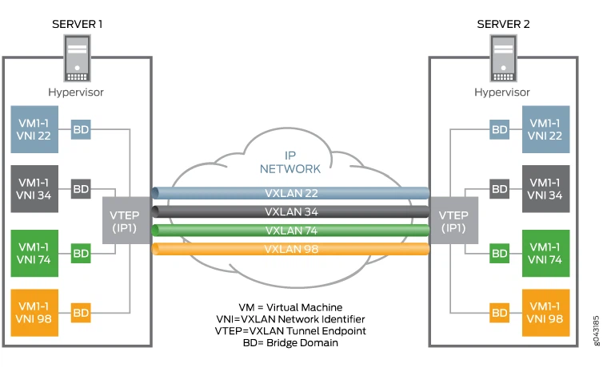
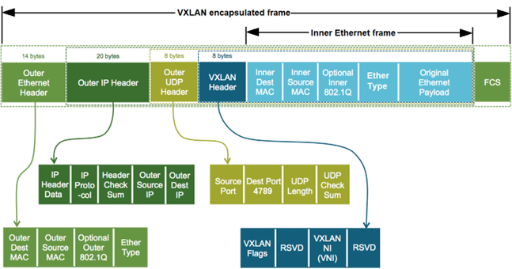

## Flyio
Anycast + BGP edge puts a single IP (v6/v4) on the global Internet; traffic is steered to the closest region where your app has capacity. TLS terminates at the edge (Fly Proxy) and requests are forwarded over Fly’s private backbone
- Private org network (“6PN”): every org gets an IPv6 mesh built with WireGuard tunnels; apps see each other on a private network by default.
- Apps within your org auto-join an IPv6 WireGuard mesh; they can talk over .internal DNS or 6PN addresses with no public exposure.

- When you provision a Fly Postgres cluster, it uses Flycast internally:
  - The cluster exposes Flycast addresses like pg.internal for connections.
  - This lets your apps connect without exposing the DB on a public IP.
  - The proxy makes sure you always hit a healthy node, and it can scale/replace nodes as needed.

## What Anycast Means (general)
- In networking, Anycast is when the same IP address is announced from multiple locations.
- Routers forward a client’s packet to the “nearest” location (according to BGP and routing policy).
This gives you:
  - One stable address for a distributed service.
  - Proximity-based routing (you hit the nearest endpoint).
  - Built-in resilience — if one location goes down, traffic goes elsewhere.

## How Flycast Uses Anycast Ideas
- A Flycast address is a private IP that exists everywhere inside your org’s 6PN mesh network.
- You don’t connect directly to a specific Machine’s IPv6 address; instead, you connect to this shared, Anycast-like endpoint.
- The Fly Proxy in your nearest Fly region picks up that connection and forwards it to a healthy Machine for the app.
So:
- Same address, multiple possible destinations.
Nearest entry point chosen automatically.

#### The Fly Private Network (6PN)
- Every Fly organization gets a private IPv6 network called the 6PN.
- All Machines (your Firecracker VMs) get an address on this network.
- This network is completely isolated from the public Internet.

#### WireGuard Under the Hood
- The 6PN is implemented using WireGuard tunnels between:
  - Your client (when you connect from your laptop or CI/CD using flyctl).
  - The edge proxies in Fly regions.
  - The hypervisors hosting your Machines.
- WireGuard provides:
  - Strong encryption (ChaCha20-Poly1305).
  - Lightweight tunneling with very low overhead.
  - Automatic key rotation (Fly handles ephemeral peer keys)

  `Fly.io runs its private org-level network on WireGuard tunnels.`


### Local dev / client → Fly
- You configure a WireGuard peer on your laptop (via `flyctl wireguard create`).
- Your laptop gets an IPv6 address inside your org’s 6PN.
When you connect to an app’s private address (my-app.internal), the packet is encrypted and tunneled over WireGuard to the nearest Fly edge.

### Fly Edge Proxy
- The Fly Proxy at that edge:
  - Decrypts the packet (WireGuard).
  - Sees the destination (a Machine or a Flycast address).
  - Decides where to forward traffic:
     - Directly to a Machine’s private IPv6 (6PN direct).
     - Or to a Flycast address, in which case the proxy applies load balancing, health checks, or autostart before choosing a Machine.

### Inside Fly’s Backbone
- If the target Machine is in another region, Fly forwards the request over its private backbone (still encapsulated in WireGuard tunnels between edges and hosts).
- Traffic is routed securely across Fly’s global mesh.


### App-Scoped Registry
- Each Fly app has its own set of Machines.
When you fly deploy or fly machine create, those Machines are registered in Fly’s control plane under that app only.
- The Fly Proxy maintains a mapping of →
  - Machine 6PN addresses
  - Health status
  - Region/host info
  - Config (like scale-to-zero eligibility, concurrency limits) for that app’s Machines.
So if you have `my-api` and `my-worker`, their Machine pools are independent. The proxy doesn’t mix them up.

By default, Machines of an app are reachable as:
`- appname.internal` → resolves to that app’s Flycast address (proxy-managed).
- `machine-id.vm.appname.internal` → resolves to a specific Machine’s 6PN address (direct)

If you have `api` and `db` apps:
- `api.internal` only resolves to the proxy-managed pool for the API Machines.
- `db.internal` only resolves to the Machines for Postgres.

```sh
           +-------------+
Client --->| api.fly.dev |--- Anycast ---> Nearest Fly Proxy
           +-------------+                   |
                                              v
                                     [ api app Machines ]
                                            |
                      +---------------------+---------------------+
                      |                                           |
             api.internal (Flycast)                       db.internal (Flycast)
                      |                                           |
            Worker Machines ------------------> [ api app ] ----> [ db app ]
                              (6PN traffic, all proxy-managed)
```

- Each app has its own DNS namespace (api.internal, db.internal, etc.).
- The Fly Proxy maintains separate Machine registries per app.
- Public Anycast DNS (.fly.dev) is for external traffic.
- Private .internal DNS is for org-only service-to-service calls.
- You can always “drop down” to direct Machine DNS if you need to bypass the proxy.


`~/.ssh/config`

```sh
Host mytunnel
  HostName ssh.example.com
  User user
  LocalForward 5432 db.internal:5432       # local forward
  DynamicForward 1080                      # socks proxy
  ServerAliveInterval 60
```


In networking, `a tunnel is when you take one kind of traffic (like TCP packets, or even whole IP packets) and encapsulate it inside another protocol, sending it across a transport channel, and then unwrapping it on the other end`.
- Outer layer = the carrier (e.g., SSH, GRE, IPsec).
- Inner layer = the traffic you’re tunneling (HTTP, SMTP, entire subnets).

Linux supports this at two levels:
- Application-level tunneling (e.g., SSH -L, -R, -D).
- Kernel-level tunneling (e.g., TUN/TAP devices, GRE/IPIP/IPsec).

## SSH Tunneling in Linux (Application-Level)
`ssh -L 8080:bar.internal:80 user@server`

- Client side (`ssh`):
 - Calls bind() and listen() on `127.0.0.1:8080`.
 - Accepts connections locally.
 - When data arrives, it wraps it into an SSH channel and sends it over the encrypted SSH TCP connection to the server.
- Server side (`sshd`):
  - Receives the SSH channel request.
  - Calls connect(`bar.internal:80`) like a normal socket connection.
  - Relays the TCP stream.

All encapsulation happens in userspace, inside the ssh and sshd processes.
The Linux kernel just sees “one SSH TCP session.”

## Kernel-Level Tunneling (TUN/TAP)
Linux also supports creating virtual network interfaces to tunnel packets instead of streams.

- TUN device
 - Acts like a point-to-point network interface (Layer 3).
 - Sends/receives raw IP packets.
 - Used by VPNs (e.g., OpenVPN, WireGuard) or ssh -w.
- TAP device
 - Acts like an Ethernet interface (Layer 2).
 - Sends/receives Ethernet frames.
 - Can be bridged into LANs.

 ```sh
 ip tuntap add dev tun0 mode tun
ip addr add 10.0.0.1/24 dev tun0
ip link set tun0 up
```

Now processes can write/read raw packets on `/dev/net/tun`.
VPN software uses this to capture IP traffic and shove it through an encrypted tunnel (e.g., OpenVPN → UDP → remote).

Linux has several kernel modules for encapsulation:
- GRE/IPIP → Encapsulate one IP packet in another.
- IPsec → Encrypt IP packets at Layer 3.
- VXLAN/Geneve → Encapsulate Layer 2 over UDP (used in Kubernetes, cloud networking).
All of these create virtual interfaces and route traffic through them.

At the OS level, tunneling = creating a virtual endpoint (socket or interface).
Data sent to that endpoint is:
- Captured by a process or kernel module.
- Encapsulated in another protocol.
- Transmitted over the carrier connection (TCP, UDP, raw IP).
- Decapsulated at the other end.
- Injected back into the OS networking stack as if it arrived locally.


## VXLAN
- Encapsulation: VXLAN encapsulates Ethernet frames inside UDP packets (default port 4789), allowing Layer 2 segments to be tunneled across Layer 3 networks.
- Overlay Network: Creates a logical Layer 2 network on top of a physical Layer 3 network.
- VXLAN Network Identifier (VNI): A 24-bit ID that uniquely identifies VXLAN segments (supports up to 16 million segments vs. 4,096 in VLANs).
Underlay vs. Overlay:
- Underlay: The physical IP network that transports the VXLAN traffic.
- Overlay: The virtual Layer 2 network created by VXLAN tunnels.

## How It Works
- A VXLAN Tunnel Endpoint (VTEP) encapsulates and decapsulates traffic.
  - Ingress VTEP: Encapsulates Ethernet frames into VXLAN packets.
  - Egress VTEP: Decapsulates VXLAN packets back into Ethernet frames.
- The VXLAN packet is carried over the IP network via UDP.
- The receiving VTEP delivers the original Ethernet frame to the correct VM or host.

## Benefits
- Massive Scalability: Supports millions of logical networks.
- Cloud & Multi-Tenant Support: Enables isolation between tenants in data centers.
- Flexibility: Extends Layer 2 across geographically dispersed data centers.
- Integration: Works with modern technologies like EVPN (Ethernet VPN) for control-plane learning instead of flooding and multicast.

Control Plane builds the map (routing, MAC learning, policies).
Data Plane uses the map to forward traffic at line speed.
VXLAN Tunnel (Layer 2 over UDP, often in Kubernetes/Cloud)

```sh
# Create a virtual Layer 2 network across two hosts (ID=42).
##On host A:
sudo ip link add vxlan42 type vxlan id 42 dev eth0 remote 203.0.113.2 dstport 4789
sudo ip addr add 10.244.1.1/24 dev vxlan42
sudo ip link set vxlan42 up

## On host B:
sudo ip link add vxlan42 type vxlan id 42 dev eth0 remote 203.0.113.1 dstport 4789
sudo ip addr add 10.244.1.2/24 dev vxlan42
sudo ip link set vxlan42 up

ping 10.244.1.2   # from host A

## Traffic is encapsulated in UDP port 4789 and looks like normal packets inside.

```

Both hosts see each other on the same virtual Layer 2 network, even if separated by the internet.
### TUN device (Layer 3)
Create an encrypted point-to-point tunnel with SSH.

```sh
# On client:
sudo ssh -w 0:0 user@server.com
sudo ip addr add 10.0.0.1/30 dev tun0
sudo ip link set tun0 up

# On server:
sudo ip addr add 10.0.0.2/30 dev tun0
sudo ip link set tun0 up

```
- Packets routed to tun0 → delivered to `/dev/net/tun`.
- The SSH process is reading from `/dev/net/tun`, encapsulating packets into the SSH TCP session.
- On the other side, SSH writes into `/dev/net/tun`, and the kernel delivers them through its tun0 interface.

`10.0.0.0/30 dev tun0 proto kernel scope link src 10.0.0.1`

- When an app sends traffic (e.g., ping 10.0.0.2), the kernel looks at its routing table.
- It sees `10.0.0.2` matches `10.0.0.0/30` → dev `tun0`.
- So the kernel injects the packet into `tun0`


`tun0` is connected to `/dev/net/tun`
`tun0` doesn’t send to a wire — instead it hands the packet to a file descriptor in `/dev/net/tun`.
- The `ssh` process has that file descriptor open.
So SSH reads the raw IP packet, wraps it into the encrypted session, and ships it to the remote host.

### Remote side does the reverse
- SSH on the remote writes the packet into its own /`dev/net/tun` (tun0).
- The server’s kernel sees it as if it came from a real NIC.
### GRE/IPIP Tunnel (Encapsulate IP in IP)
```sh
# On both client and server
sudo ip tunnel add gre1 mode gre remote 192.0.2.2 local 192.0.2.1 ttl 255
sudo ip link set gre1 up
sudo ip addr add 10.10.0.1/30 dev gre1  # client
sudo ip addr add 10.10.0.2/30 dev gre1  # server
```
Creates a GRE tunnel between two public IPs, carrying private IP packets (10.10.0.x).

### GRE/IPIP Tunnel
Goal: Connect two public IP hosts (`192.0.2.1 and 192.0.2.2`) with a private network (10.10.0.0/30).
#### On host A:
```sh
sudo ip tunnel add gre1 mode gre local 192.0.2.1 remote 192.0.2.2 ttl 255
sudo ip link set gre1 up
sudo ip addr add 10.10.0.1/30 dev gre1
```
#### On host B:
```sh
sudo ip tunnel add gre1 mode gre local 192.0.2.2 remote 192.0.2.1 ttl 255
sudo ip link set gre1 up
sudo ip addr add 10.10.0.2/30 dev gre1
```
Test:
ping 10.10.0.2   # from host A


Psec Tunnel (Site-to-Site VPN)
Goal: Connect two networks securely (10.0.0.0/24 ↔ 10.1.0.0/24).


site-to-site WireGuard tunnel:
Site A (10.0.0.0/24) connects to Site B (10.1.0.0/24).


Fly.io runs apps in many global data centers, and they need a way for:
- Your apps (VMs/containers) to talk to each other privately across regions.
- You (the developer) to securely manage those apps from your laptop or servers.
- All of this to be secure, fast, and automated, without you setting up VPNs manually.
They solve this with WireGuard tunnels

## WireGuard Peers Everywhere
- Each host machine (Fly.io edge server) runs a WireGuard endpoint.
- Each customer machine (your laptop, CI/CD pipeline, etc.) can be configured as a WireGuard peer to join the private network.
- This creates a mesh of secure tunnels across Fly.io’s global backbone.

### Developer Access
When you run `flyctl wireguard create`, Fly.io automatically generates WireGuard keys and gives you a ready-to-use config.
This allows you to connect your laptop (or Kubernetes cluster, etc.) into the Fly.io private network as if it were another site in a site-to-site VPN.


## Traffic Flow
- Suppose you deploy a Redis instance in Amsterdam and a web app in Singapore: Each gets a private IPv6 address.
- When the web app connects to Redis, the traffic is sent over WireGuard tunnels inside Fly.io’s backbone.
- The traffic is encrypted end-to-end, even though it may cross the public Internet between Fly data centers.


- The 6PN private network is scoped to your Fly.io organization (account/team).
- All apps in the same Fly.io org share a single private IPv6 network space.
This means:
- App A (Redis) in Frankfurt and App B (API server) in Chicago can talk to each other privately.
- If you deploy 10 apps under the same org, they all join the same private mesh
- You can still restrict connectivity at the app level with firewall rules (security groups) or by controlling which IP ranges are allowed to connect.

- When you run `flyctl wireguard create`, you’re adding your laptop (or server) as a peer into the org’s network.
- That peer can now directly reach any app in the org’s private 6PN.

```sh
fly launch --name redis-app --region fra
fly launch --name api-app --region ord
```

There are two basic ways to talk to a process running in your Fly Machine:

- Via Fly Proxy, the Fly.io component that handles load balancing—this is what you’ll need for any public web service
- Over the WireGuard IPv6 private network (“6PN”) that the app belongs to—this can be useful for, e.g., providing private supporting services to your Fly Apps 

## Services Routed with Fly Proxy

All services reachable from the public internet via a Fly App’s global Anycast address are routed by Fly Proxy.

-  An app with HTTP and HTTPS services defined is allocated public IPs automatically on the first run of `fly deploy`; you can confirm with `fly ips list`

By default, all of an organization’s Fly Apps live on the same private network, but you can create apps on different private networks to isolate them from one another. You’d want to do this if you run separate apps for your customers, for example.

```sh
          Client (Internet)
                |
         api.fly.dev (Anycast)
                |
        Nearest Fly Proxy
                |
        [ api app Machines ]
         |              |
  api.internal      fra.api.internal
   (any region)      (only FRA)

         Worker Machines
          |          |
   api.internal   fra.db.internal ---> [ db app FRA ]
          |
   mad.db.internal ------------------> [ db app MAD ]
                     (leader writes)
```

### What Are Tunnel Endpoints?
A tunnel endpoint is just a network interface (physical or virtual) at each end of the tunnel.
It is responsible for:
- Encapsulation → Wrapping the original packet inside another packet.
- Transmission → Sending it across the underlay (usually the public Internet).
- Decapsulation → Unwrapping the packet back to the original before delivery.

- Addressing
Each endpoint must have a reachable underlay IP address (often a public IP, or behind NAT with port forwarding).
- Key Exchange / Session Setup
The endpoints exchange authentication material (keys, certs).
In WireGuard → Public/Private key pairs.
In IPsec → Certificates or pre-shared keys.
- Encapsulation
Endpoint A encapsulates the original packet (e.g., 10.0.0.5 → 10.1.0.10) inside an outer packet addressed to Endpoint B (203.0.113.1 → 198.51.100.2).
- Transport Across Underlay
The underlay network (Internet, MPLS, or private backbone) just sees regular UDP/IP traffic.
Routers in between don’t know it’s a tunnel — they just forward based on the outer IP header.
- Decapsulation
Endpoint B receives the packet, strips off the outer headers, and delivers the inner packet (10.0.0.5 → 10.1.0.10) to its private LAN

### Full-Tunnel vs Split-Tunnel
- Split-Tunnel: Only send specific private subnets through tunnel (e.g., 10.1.0.0/24).
- Full-Tunnel: Route all traffic (default route 0.0.0.0/0) into the tunnel, so even Internet browsing goes through it.


Site A LAN: 10.0.0.0/24
Site B LAN: 10.1.0.0/24

```sh
#At Site A
Destination      Interface
10.0.0.0/24      local LAN
10.1.0.0/24      wg0 (tunnel)
default          eth0 (Internet)
```
- Traffic to 10.1.0.x → goes into wg0 → encapsulated → sent to Site B endpoint.
- Traffic to Google (8.8.8.8) → goes out eth0 to the Internet (not through tunnel, unless configured).
```sh
#At Site B
Destination      Interface
10.1.0.0/24      local LAN
10.0.0.0/24      wg0 (tunnel)
default          eth0 (Internet)
```
- Traffic to 10.0.0.x → goes into wg0 → encapsulated → sent to Site A endpoint.
- Other Internet traffic → still goes out eth0

Each site’s routing table reflects its own local LAN as “directly connected”:
```sh
Site A machine:
10.0.0.0/24   → LAN (direct)
10.1.0.0/24   → tunnel
Site B machine:
10.1.0.0/24   → LAN (direct)
10.0.0.0/24   → tunnel
```
- At Site A, 10.0.0.x = local network (no need to tunnel).
- At Site B, 10.1.0.x = local network.
- The “remote” site always goes via the tunnel
- this is exactly how routing symmetry works in a site-to-site tunnel
- Each site sees its own subnet as local, and the other site’s subnet as remote, which must go through the tunnel

At its core, WireGuard is a point-to-point encrypted tunnel.
Two peers exchange keys and send traffic to each other.


```sh
#Site A
ip tunnel add gre1 mode gre remote 198.51.100.2 local 192.0.2.1 ttl 255
ip addr add 10.0.0.1/30 dev gre1
ip link set gre1 up

#Site B
ip tunnel add gre1 mode gre remote 192.0.2.1 local 198.51.100.2 ttl 255
ip addr add 10.0.0.2/30 dev gre1
ip link set gre1 up
```
You now have a point-to-point interface gre1 (10.0.0.1 ↔ 10.0.0.2)

### kubectl port-forward (TCP only)


```sh
# Pod → local:8080 forwards to the pod’s 8080
kubectl port-forward pod/web-6f9c 8080:8080

# Deployment (choose a pod automatically)
kubectl port-forward deploy/web 8080:8080

# Service (nice for databases)
kubectl -n prod port-forward svc/postgres 5432:5432

# Multiple ports
kubectl port-forward pod/web 8080:80 8443:443

# Listen on all interfaces (share with teammates on your LAN; lock down your firewall!)
kubectl port-forward --address 0.0.0.0 svc/grafana 3000:3000
```

### kubectl proxy
Local HTTP proxy to the Kubernetes API—handy for API exploration
`kubectl proxy --port=8001 --address=127.0.0.1`

source and destination ports in tcp are each `16` bits, making the maximum value `2^16=65,536`

Minikube is an open-source tool that lets you run a single-node Kubernetes cluster locally on your computer


store keys in cloud KMS / HashiCorp Vault;

64 byte is the Type	Minimum Frame Size	Notes
Ethernet II / IEEE 802.3	64 bytes	Standard wired Ethernet
VLAN-tagged (802.1Q) frame	68 bytes	4 bytes longer due to VLAN tag
Jumbo frame (nonstandard)	Not less than 64 bytes	Typically larger max, but same minimum

```sh
#Ethernet Frame Structure (Standard – 64 to 1518 bytes)
|<---- 8 bytes ---->|<-------------------------- 64 to 1518 bytes -------------------------->|

+-------------------+--------+--------+------+--------------------+---------+
| Preamble + SFD    | Dest.  | Source | Type |     Payload        |   FCS   |
|   (8 bytes)       |  MAC   |  MAC   |/Len  | (46–1500 bytes)    | (4 B)   |
|                   | (6 B)  | (6 B)  | (2 B)|                    |         |
+-------------------+--------+--------+------+--------------------+---------+
                   ↑                                                      ↑
                 Frame begins                                        Frame ends
```
- Preamble (7 bytes) + Start Frame Delimiter (1 byte):
Used to synchronize clocks between sender and receiver.
Not counted in the 64-byte minimum frame length.
- Destination MAC (6 bytes):
The hardware address of the receiving device.
- Source MAC (6 bytes):
The hardware address of the sender.
- Type/Length (2 bytes):
Indicates the protocol type (EtherType) or payload length (in IEEE 802.3).
- Payload (46–1500 bytes):
Actual data being carried.
If data is less than 46 bytes, padding is added to reach the minimum.
- FCS (4 bytes):
Frame Check Sequence (CRC) used for error detection.

```sh
# VLAN-Tagged Ethernet Frame (802.1Q – up to 1522 bytes)
|<---- 8 bytes ---->|<-------------------------------- 68 to 1522 bytes -------------------------------->|
+-------------------+--------+--------+------+--------+--------------------+---------+
| Preamble + SFD    | Dest.  | Source | Type | VLAN   |     Payload        |   FCS   |
|   (8 bytes)       |  MAC   |  MAC   |/Len  | Tag    | (46–1500 bytes)    | (4 B)   |
|                   | (6 B)  | (6 B)  | (2 B)| (4 B)  |                    |         |
+-------------------+--------+--------+------+--------+--------------------+---------+
```

```sh
# Jumbo Frame (Example: 9000 bytes total)
+--------+--------+------+-------------------------------+---------+
| Dest.  | Source | Type |          Payload (~8972 B)    |   FCS   |
+--------+--------+------+-------------------------------+---------+
```

### What Is the EtherType Field?
The EtherType field (2 bytes, or 16 bits) is part of the Ethernet frame header.
It identifies which protocol is encapsulated in the payload of the frame.
It helps the receiving device know how to interpret the data (e.g., IPv4, IPv6, ARP, VLAN, etc.).

Common EtherType Values
EtherType (Hex)	Protocol / Payload Type	Description
0x0800	IPv4	Internet Protocol version 4
0x0806	ARP	Address Resolution Protocol
0x0842	Wake-on-LAN	Wake-on-LAN magic packet
0x22F3	IETF TRILL Protocol	Transparent Interconnection of Lots of Links
0x22EA	Stream Reservation Protocol (SRP)	Time-sensitive networking control
0x6003	DECnet Phase IV	Digital Equipment Corporation protocol
0x8035	RARP	Reverse Address Resolution Protocol
0x809B	AppleTalk (Ethertalk)	Apple networking protocol
0x80F3	AARP	AppleTalk Address Resolution Protocol
0x8100	VLAN-tagged frame (IEEE 802.1Q)	Indicates VLAN tagging and priority bits
0x8137	IPX	Novell Internetwork Packet Exchange
0x8204	QNX Qnet	QNX networking
0x86DD	IPv6	Internet Protocol version 6
0x8808	Ethernet Flow Control (PAUSE frame)	IEEE 802.3x flow control
0x8809	Slow Protocols (LACP, Marker)	IEEE 802.3 Slow Protocols
0x8847	MPLS Unicast	Multiprotocol Label Switching (unicast)
0x8848	MPLS Multicast	Multiprotocol Label Switching (multicast)
0x8863	PPPoE Discovery Stage	Point-to-Point Protocol over Ethernet discovery
0x8864	PPPoE Session Stage	Point-to-Point Protocol over Ethernet session
0x8870	Jumbo Frames (nonstandard)	Used by some vendors to mark jumbo frames
0x887B	HomePlug 1.0 MME	Powerline networking
0x888E	EAP over LAN (802.1X)	Network access authentication
0x88A8	Q-in-Q (802.1ad)	Provider bridging (stacked VLANs)
0x88CC	LLDP (Link Layer Discovery Protocol)	Device discovery protocol
0x88E5	MAC Security (MACsec)	IEEE 802.1AE security protocol
0x88F7	Precision Time Protocol (PTP)	IEEE 1588 timing sync
0x8906	Fibre Channel over Ethernet (FCoE)	Storage networking
0x8915	RoCE (RDMA over Converged Ethernet)	High-performance remote memory access
0x9100	VLAN-tagged (Q-in-Q)	Double-tagged VLAN frame


```sh
[ Outer Ethernet ]
   ├── Outer IP Header (IPv4 or IPv6)
   ├── UDP Header (destination port 4789)
   ├── VXLAN Header (8 bytes)
   └── Inner Ethernet Frame
        ├── Destination MAC
        ├── Source MAC
        ├── EtherType
        ├── Payload
        └── FCS
```




### Configuring VXLAN with Linux

- You can create a VXLAN interface on Linux using the following commands:
- Step 1: Create a VXLAN Interface
`ip link add vxlan0 type vxlan id 42 dev eth0 dstport 4789`
- Step 2: Assign an IP Address
`ip addr add 192.168.100.1/24 dev vxlan0`
- Step 3: Bring Up the Interface
`ip link set vxlan0 up`

### VXLAN in Kubernetes (Example with Flannel)
Many CNI plugins in Kubernetes, such as Flannel, use VXLAN to provide network connectivity between pods across nodes.

Flannel Configuration Example:
```sh
    apiVersion: networking.k8s.io/v1
    kind: NetworkPolicy
    metadata:
      name: flannel-vxlan-config
    spec:
      backend: vxlan
```
Benefit:
Pods can communicate seamlessly across nodes by leveraging VXLAN-based networking

#### Troubleshooting VXLAN

Here are a few commands to diagnose and troubleshoot VXLAN issues:

- Check VXLAN Interface:
`ip link show vxlan0`
- Check Routing Table:
`ip route show`
- Capture VXLAN Traffic (using tcpdump):
`tcpdump -i eth0 udp port 4789`

[kubernetes-vxlan](https://support.tools/training/networking/kubernetes-vxlan/)

EVPN uses BGP to exchange endpoint MAC and IP address information between VXLAN tunnel endpoints (VTEPs). In this topology, each pair of leaf switches in a rack is one logical VTEP. Packets destined to a remote device are sent to the local VTEP as the first hop. The packet is encapsulated with a VXLAN header that includes the Virtual Network Identifier (VNI) and the IP address of the destination host. See the figure below


The destination VTEP extracts the original packet and routes it to the final destination. VXLAN encapsulation adds approximately 50 bytes of overhead to each Ethernet frame. As a result, all switches in the underlay (physical) network must be configured to support an MTU of at least 1600 bytes on all participating interfaces. 
the ethertype determines the handler to be used


Port forwarding lets you use SSH as a tunnel that carries arbitrary TCP traffic — not just terminal


The bits in the frame are encoded into voltage or light level changes depending on the medium.
The specific encoding scheme depends on the Ethernet standard:
Ethernet Type	Bit Rate	Encoding Scheme	Description
10BASE-T	10 Mbps	Manchester Encoding	Each bit encoded as a voltage transition in the middle of the bit period: 0 = high→low, 1 = low→high.
100BASE-TX	100 Mbps	4B/5B + MLT-3	4 bits are mapped to 5-bit codes (4B/5B) for enough transitions, then sent using Multi-Level Transmission-3 (3 voltage levels).
1000BASE-T	1 Gbps	PAM-5 (Pulse Amplitude Modulation with 5 levels)	Each symbol carries 2 bits across 4 wire pairs simultaneously.
10GBASE-T	10 Gbps	PAM-16 (16 amplitude levels)	Advanced DSP techniques to handle noise and crosstalk


[Intro to fiber optics and RF encoding](https://www.youtube.com/watch?v=lUo45NqPyq8&list=PLowKtXNTBypH19whXTVoG3oKSuOcw_XeW&index=2)


## Orchestration

Orchestrators link clusters of worker servers together and offer up an API to run jobs on them. Kubernetes is an orchestrator; the Kleenex of orchestrators. Then, HashiCorp has Nomad, which we use,

```sh
# fly help
Deploying apps & machines
  apps         Manage apps.
  deploy       Deploy Fly applications
  launch       Create and configure a new app from source code or a Docker image
  machine      Manage Fly Machines.
  status       Show app status

Configuration & scaling
  certs        Manage certificates
  config       Manage an app's configuration
  image        Manage app image
  ips          Manage IP addresses for apps
  scale        Scale app resources
  secrets      Manage application secrets with the set and unset commands.
  volumes      Manage Fly Volumes.

Monitoring & managing things
  checks       Manage health checks
  console      Run a console in a new or existing machine
  dashboard    Open web browser on Fly Web UI for this app
  dig          Make DNS requests against Fly.io's internal DNS server
  incidents    Show incidents
  logs         View app logs
  mcp          flyctl Model Context Protocol.
  ping         Test connectivity with ICMP ping messages
  proxy        Proxies connections to a Fly Machine.
  releases     List app releases
  services     Show the application's services
  sftp         Get or put files from a remote VM.
  ssh          Use SSH to log into or run commands on Machines
  wireguard    Commands that manage WireGuard peer connections

Databases & extensions
  consul       Enable and manage Consul clusters
  extensions   Extensions are additional functionality that can be added to your Fly apps
  litefs-cloud LiteFS Cloud management commands
  mpg          Manage Managed Postgres clusters.
  mysql        Provision and manage MySQL database clusters
  postgres     Unmanaged Postgres cluster commands
  redis        Launch and manage Redis databases managed by Upstash.com
  storage      Provision and manage Tigris object storage buckets

Access control
  auth         Manage authentication
  orgs         Commands for managing Fly organizations
  tokens       Manage Fly.io API tokens

Help & troubleshooting
  docs         View Fly documentation
  doctor       The DOCTOR command allows you to debug your Fly environment
  platform     Fly platform information

Additional Commands:
  agent        Commands that manage the Fly agent, a background process that manages flyctl wireguard connections
  completion   Generate the autocompletion script for the specified shell
  help         Help about any command
  jobs         Show jobs at Fly.io
  settings     Manage flyctl settings
  synthetics   Synthetic monitoring
  version      Show version information for the flyctl command
  ```

- Create apps for each environment (staging & prod):
```sh
fly launch --name myapp-staging --region sin   # interactive for staging
fly launch --name myapp-prod    --region sin   # production app
```

- Deploy to staging, run smoke tests:
```sh
fly deploy --app myapp-staging --image registry.fly.io/myorg/myapp:$SHA --remote-only
# run automated smoke tests against staging URL
```

- Deploy a canary to prod by scaling a small count (1 instance), run live checks, then increase:
```sh
# step 1: deploy single-instance canary
fly deploy --app myapp-prod --image registry.fly.io/myorg/myapp:$SHA --remote-only
fly scale count 1 --app myapp-prod   # ensure only 1 instance runs (instance=canary)

# wait, run canary smoke tests, monitor logs/metrics:
fly logs --app myapp-prod --instance <id-if-needed>   # stream canary logs

# step 2: promote to full production (scale up gradually)
fly scale count 3 --app myapp-prod    # prod fleet -> 3
fly scale count 10 --app myapp-prod   # scale to desired capacity

```

`Use separate apps for staging/prod so artifact promotion is explicit and safe.`

### Persistent storage — production volumes, backups, snapshots
- Create production volume (region-local):
```sh
fly volumes create prod-data-vol --size 200 --region sin
# mount declared in fly.toml under [mounts] so deploy attaches the volume
```

### Secrets, tokens, and least-privilege CI
- Create a CI token (least privilege):
# create token for CI with only necessary scopes (example)
```sh
fly tokens create --name ci-deploy-token
# store the returned token in GitHub Actions Secrets as FLY_API_TOKEN
```
- Use secrets in app (rotate safely):
`fly secrets set REDIS_URL="redis://..." STRIPE_SECRET="sk_live_..."`

### Production TLS, custom domains & static IPs
- Provision certs / configure custom domain
```sh
# create a cert for your app (Fly can manage Let’s Encrypt certs)
fly certs create example.com --app myapp-prod

# configure DNS to point to Fly (usually CNAME to app.fly.dev or use allocated IP)
```
- Allocate static anycast IPs (for dropping in front of apps):
```sh
fly ips allocate v4 --region sin
fly ips list --app myapp-prod
```
Notes
Use static IPs if you need fixed IP allowlists (firewalls, partner APIs)

```sh
which flyctl
/opt/homebrew/bin/flyctl
which fly   
/opt/homebrew/bin/fly
```

```sh
fly version
fly v0.3.202 darwin/arm64 Commit: d170dd15b783eafe37a895494716d0414c4ed4c2 BuildDate: 2025-10-23T13:41:02Z
flyctl version 
flyctl v0.3.202 darwin/arm64 Commit: d170dd15b783eafe37a895494716d0414c4ed4c2 BuildDate: 2025-10-23T13:41:02Z

## or compare file hashes
shasum -a 256 /opt/homebrew/bin/fly /opt/homebrew/bin/flyctl

5a0d9e7e4765fd3d9112c10bb5a09ab15b01774368d7524009af1baf99aae9b0  /opt/homebrew/bin/fly
5a0d9e7e4765fd3d9112c10bb5a09ab15b01774368d7524009af1baf99aae9b0  /opt/homebrew/bin/flyctl
```
