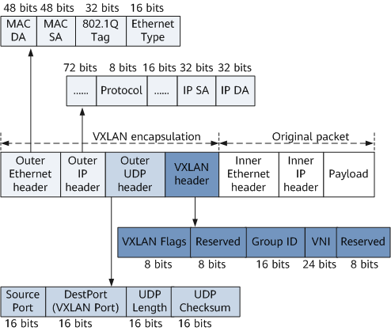
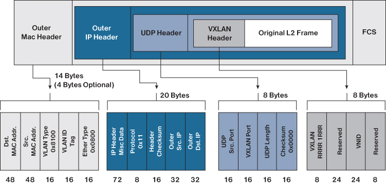
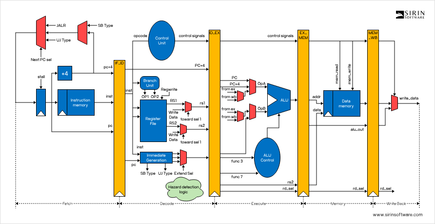
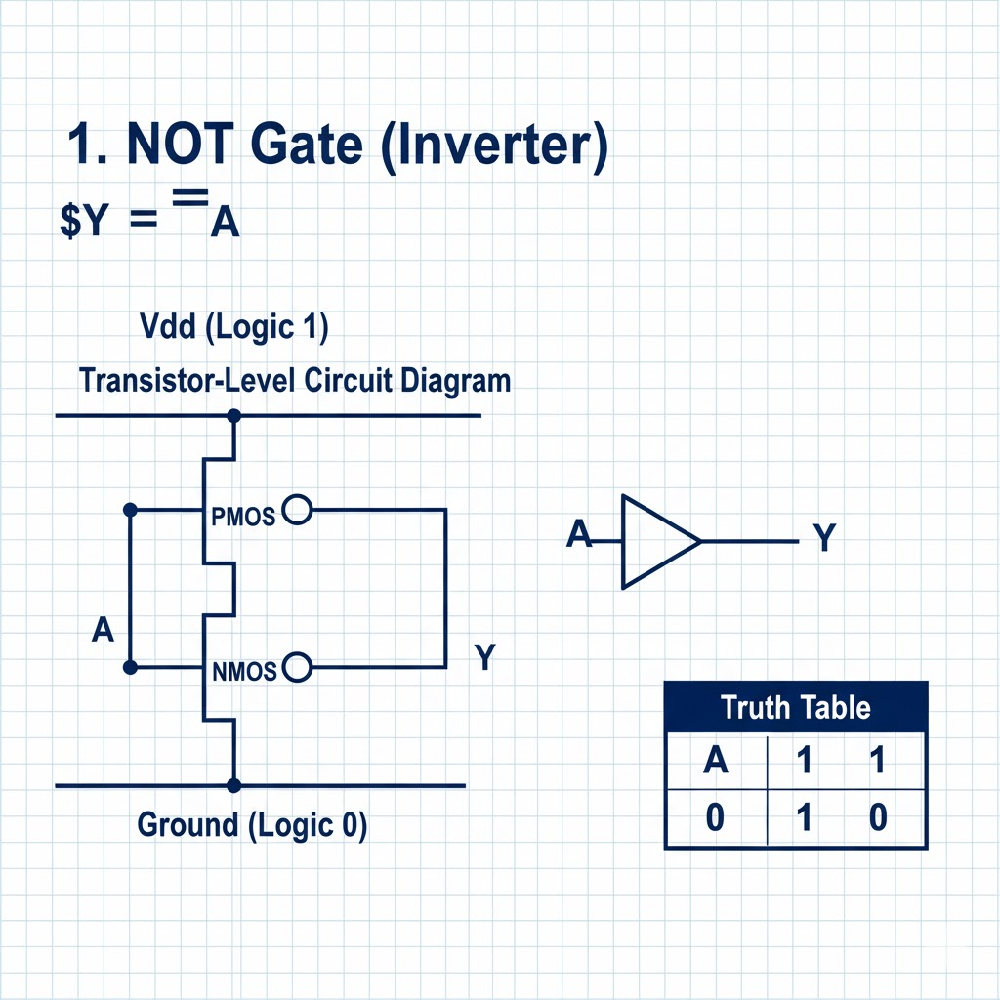
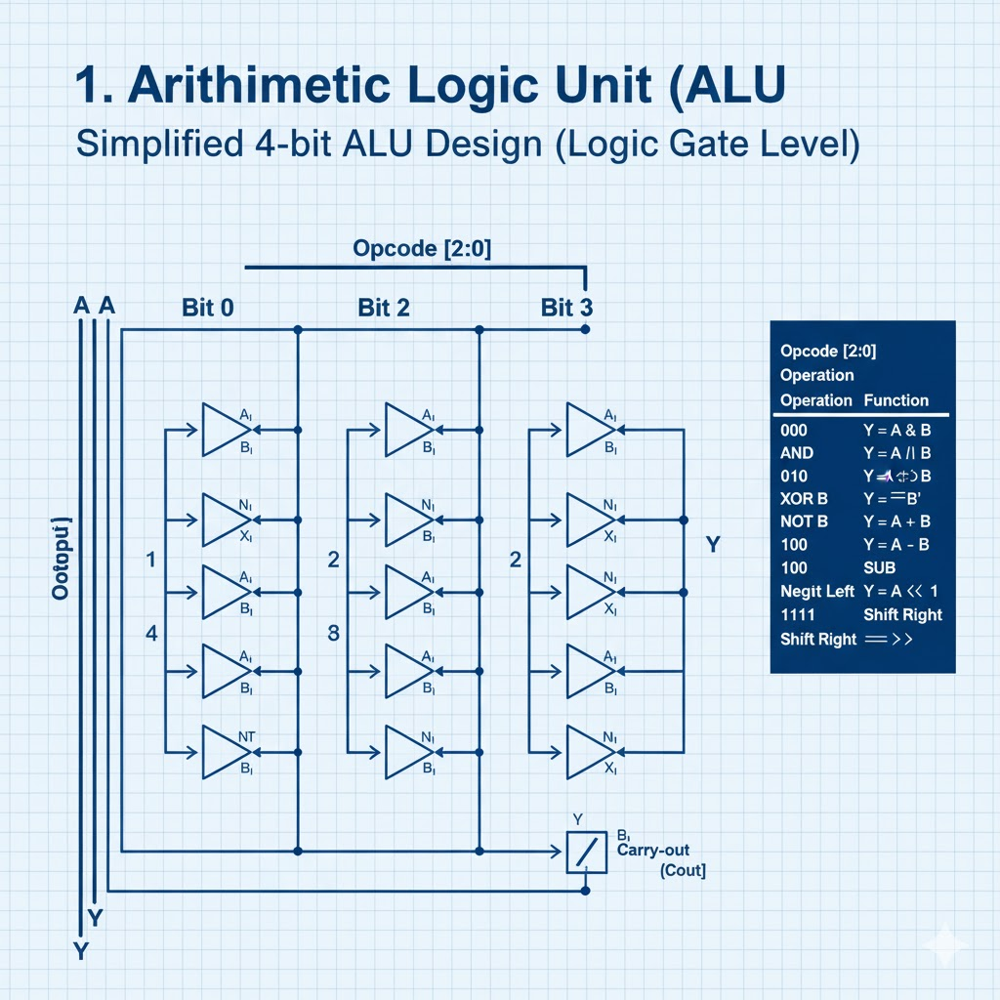
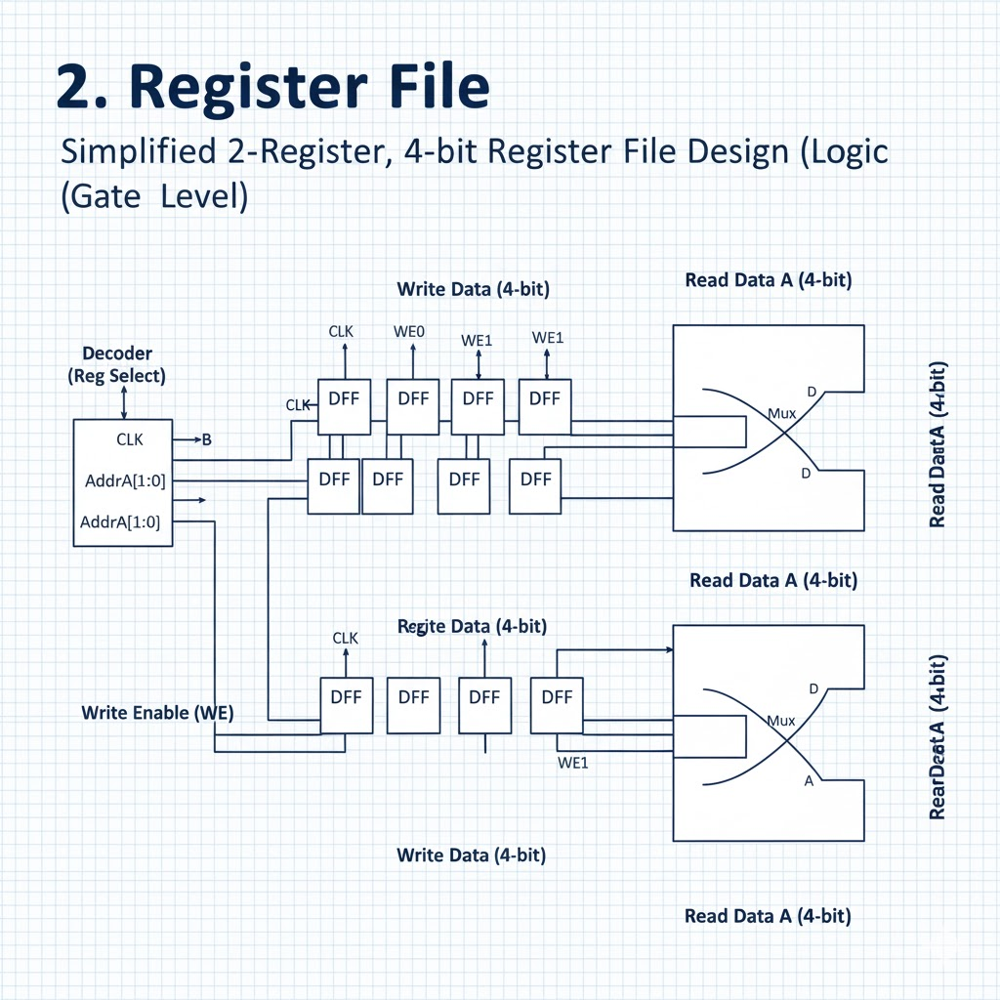

# Networking and Kubernetes(book)

IP addresses are assigned to network interfaces. A typical interface may have one IPv4 address and one IPv6 address, but multiple addresses can be assigned to the same interface.


 Bridges allow pods, with their individual network interfaces, to interact with the broader network via the node’s network interface.

 

 The veth device is a local Ethernet tunnel. Veth devices are created in pairs

  Packets transmitted on one device in the pair are immediately received on the other device. When either device is down, the link state of the pair is down

```sh
NF_IP_PRE_ROUTING(Netfilter hook)

PREROUTING(Iptables chain)

Triggers when a packet arrives from an external system.
```
```sh
NF_IP_LOCAL_IN(Netfilter hook)

INPUT(Iptables chain)

Triggers when a packet’s destination IP address matches this machine.
```

```sh
NF_IP_FORWARD(Netfilter hook)

NAT(Iptables chain)

Triggers for packets where neither source nor destination matches the machine’s IP addresses (in other words, packets that this machine is routing on behalf of other machines).

```
```sh
NF_IP_LOCAL_OUT(Netfilter hook)

OUTPUT(Iptables chain)

Triggers when a packet, originating from the machine, is leaving the machine.
```

```sh
NF_IP_POST_ROUTING(Netfilter hook)

POSTROUTING(Iptables chain)

Triggers when any packet (regardless of origin) is leaving the machine.

```


We can infer from our flow diagram that only certain permutations of Netfilter hook calls are possible for any given packet. For example, a packet originating from a local process will always trigger `NF_IP_LOCAL_OUT` hooks and then `NF_IP_POST_ROUTING` hooks. In particular, the flow of Netfilter hooks for a packet depends on two things: if the packet source is the host and if the packet destination is the host. Note that if a process sends a packet destined for the same host, it triggers the `NF_IP_LOCAL_OUT` and then the `NF_IP_POST_ROUTING` hooks before “reentering” the system and triggering the `NF_IP_PRE_ROUTING` and `NF_IP_LOCAL_IN` hooks.


```sh
Packet source	  Packet destination	Hooks (in order)
Local machine     Local machine         NF_IP_LOCAL_OUT, NF_IP_LOCAL_IN

Local machine     External machine      NF_IP_LOCAL_OUT, NF_IP_POST_ROUTING

External machine  Local machine         NF_IP_PRE_ROUTING, NF_IP_LOCAL_IN

External machine   External machine     NF_IP_PRE_ROUTING, NF_IP_FORWARD, NF_IP_POST_ROUTING


#Note that packets from the machine to itself will trigger NF_IP_LOCAL_OUT and NF_IP_POST_ROUTING and then “leave” the network interface. They will “reenter” and be treated like packets from any other source
```

Network address translation (NAT) only impacts local routing decisions in the `NF_IP_PRE_ROUTING` and `NF_IP_LOCAL_OUT `hooks (e.g., the kernel makes no routing decisions after a packet reaches the `NF_IP_LOCAL_IN` hook). We see this reflected in the design of iptables, where source and destination NAT can be performed only in specific hooks/chains.

NAT relies on Conntrack to function. iptables exposes NAT as two types: SNAT (source NAT, where iptables rewrites the source address) and DNAT (destination NAT, where iptables rewrites the destination address).

Conntrack identifies connections by a tuple, composed of source address, source port, destination address, destination port, and L4 protocol. These five pieces of information are the minimal identifiers needed to identify any given L4 connection. All L4 connections have an address and port on each side of the connection; after all, the internet uses addresses for routing, and computers use port numbers for application mapping. The final piece, the L4 protocol, is present because a program will bind to a port in TCP or UDP mode (and binding to one does not preclude binding to the other). Conntrack refers to these connections as flows. A flow contains metadata about the connection and its state.

Conntrack stores flows in a hash table,using the connection tuple as a key


```sh
#Conntrack’s max size
cat /proc/sys/net/nf_conntrack_max
65536

#hash table size 
cat /sys/module/nf_conntrack/parameters/hashsize
65536
```

Conntrack entries contain a connection state, which is one of four states.

When Conntrack is active, `conntrack -L` shows all current flows.

```sh
# anatomy of a Conntrack flow,
tcp      6 431999 ESTABLISHED src=10.0.0.2 dst=10.0.0.1
sport=22 dport=49431 src=10.0.0.1 dst=10.0.0.2 sport=49431 dport=22 [ASSURED]
mark=0 use=1

#<protocol> <protocol number> <flow TTL> [flow state>] <source ip> <dest ip> <source port> <dest port> [] <expected return packet>

```
`The expected return packet is of the form <source ip> <dest ip> <source port> <dest port>`

Subnets are specified by the destination and genmask values.

```sh
# route
Kernel IP routing table
Destination    Gateway         Genmask         Flags Metric Ref    Use Iface
0.0.0.0        10.0.0.1        0.0.0.0         UG    303    0        0 eth0
10.0.0.0       0.0.0.0         255.255.255.0   U     303    0        0 eth0

```
Linux prefers to route packets by specificity (how “small” a matching subnet is) and then by weight (“metric” in route output). Given our example, a packet addressed to `10.0.0.1` will always be sent to gateway `0.0.0.0` because that route matches a smaller set of addresses. If we had two routes with the same specificity, then the route with a lower metric wiould be preferred.

10.0.0.0/24 smaller than 0.0.0.0 with only host bits


Cilium (a kube-proxy alternative)

a table contains chains, and a chain contains rules.

Chains contain a list of rules. When a packet executes a chain, the rules in the chain are evaluated in order. Chains exist within a table and organize rules according to Netfilter hooks. There are five built-in, top-level chains, each of which corresponds to a Netfilter hook

iptables executes tables in a particular order: `Raw, Mangle, NAT, Filter`

The order of execution is chains, then tables. So, for example, a packet will trigger `Raw PREROUTING`, `Mangle PREROUTING`, `NAT PREROUTING`, and then trigger the Mangle table in either the `INPUT` or `FORWARD` chain (depending on the packet).

iptables chains are a list of rules. When a packet triggers or passes through a chain, each rule is sequentially evaluated, until the packet matches a “terminating target” (such as DROP), or the packet reaches the end of the chain.


 DNAT can be performed in `PREROUTING` or `OUTPUT`, and SNAT can be performed in only `INPUT` or `POSTROUTING`.


1. PREROUTING
   1. Raw
   2. Mangle
   3. NAT

2. INPUT
   1. Mangle
   2. NAT
   3. Filter

 when a packet triggers a chain, iptables executes tables within that chain

 `iptables -t nat -A POSTROUTING -o eth0 -j MASQUERADE`

 To display a particular type of DNS record, run `dig <domain> <type>` (or `dig -t <type> <domain>`)

 `dig kubernetes.io TXT`


 From a networking perspective, with one operating system, there is one TCP/IP stack. That single stack creates issues with port conflicts on the host machine

 Each container also has its own network stack

 Image layers in a repository are connected in a parent-child relationship. Each image layer represents changes between itself and the parent layer.

 Repositories can be equivalent to a container image. The important distinction is that repositories are made up of layers and metadata about the image; this is the manifest.

 Docker provides application portability between running on-premise, in the cloud, or in any other data center. Its motto is to build, ship, and run anywhere. 


 In Linux everything is considered a file. This includes hardware devices, processes, directories, regular files, sockets, links, and so on

 IP forwarding is an operating system’s ability to accept incoming network packets on one interface, recognize them for another, and pass them on to that network accordingly. When enabled, IP forwarding allows a Linux machine to receive incoming packets and forward them. A Linux machine acting as an ordinary host would not need to have IP forwarding enabled because it generates and receives IP traffic for its purposes

 Docker uses iptables for network isolation. The container publishes a port to be accessed externally. Containers do not receive a public IPv4 address; they receive a private RFC 1918 address. Services running on a container must be exposed port by port,


 [cni](https://www.sobyte.net/post/2022-10/go-cni/)

 [knet](https://www.sobyte.net/post/2022-10/k8s-net/)

 [container-net-1](https://www.sobyte.net/post/2022-10/container-net-1/)

 [container-net-2](https://www.sobyte.net/post/2022-10/container-net-2/)

 [ipip](https://www.sobyte.net/post/2022-10/ipip/)


[wifi-ethernet-wifi/](https://dx13.co.uk/articles/2022/11/30/wifi-ethernet-wifi/)

the frame payload is transparent to the layer two devices.

Each network interface device must have a unique MAC address within the network, otherwise the network won’t route frames reliably.

 Our devices use ARP to translate IP addresses into MAC addresses. This uses a broadcast frame to ask all devices on a network if they are assigned a particular IP address. Typically a machine on a home network has just one IP address

 `192.168.86.1`


 wifi uses the amplitude and phase of an electromagnetic (radio) wave to transmit bits in the air. 

 in general, to stop each devices waves getting muddled with other devices, at a given moment in time only a single device can transmit or receive data to an access point. This means that devices take turns speaking to their access point


 Unicast: used when a single recipient of a frame is the intended destination

 Group Addresses
 - Broadcast: Used when the Ethernet frame is intended for all the devices that are on the LAN and have a value of `FFFF.FFFF.FFFF`

 - Multicast: Used to allow many but not all of the devices on a LAN to communicate


 in kubernetes, pods are the smallest unit of deployment

any service can only have one port


each computer of the communication, stores the other's ip address and port. this combination is called a session or endpoint. The client stores the ip address and port number of the server while the server stores the client's ip address and port. Both are called a socket pair or endpoints


AM- travels further..longer wavelength


FM carries more infomation due to high frequencies

/8 is a single subnet within the entire IPv4 space (/0)

/16 is a single subnet within a /8

/24 is a single subnet within a /16


IPv4 is a 32-bit address space.

CIDR notation /N means the first N bits are fixed for network identification, and the rest are for hosts.

Each /8 is one subnet within the larger /0 space.

Each one has `16,777,216` IPs

```sh
# of subnets = 2^(new prefix - old prefix)
```
**How many /8 subnets fit in /0?**
2^(8 - 0) = 2^8 = 256 subnets

Each one has 16,777,216 IPs
**How many /16 subnets fit into a /8?**
2^(16 - 8) = 2^8 = 256 subnets

Each has 65,536 IPs

There are three types of networks in kubernetes
- node
- cluster
-pod


When a node is created, the kubelet delegates
- Creating the container to the container runtime
- Attaching the container to the  network  to the CNI
- Mounting volumes to the CSI

On the CNI part
- Each pode has its own isolated linux network namespace and is attached to a bridge

- The CNI is responsible for creating the bridge,assigning the IP and connecting `veth0` to the `cni0`


There is a thunderbolt bridge on mac with 2 2 thunderbolt interfaces

There are 4 in built interfaces on my mac
- 2 thunderbolt interfaces(type ethernet)
- one wifi( type wifi)
- bride0 of type bridge

## What is Thunderbolt Bridge?
Thunderbolt Bridge is a networking protocol that uses Thunderbolt ports on your Mac to connect to another Mac using a peer-to-peer connection. It’s often used as a way to transfer large amounts of data between two Macs quickly — Thunderbolt’s speedy transfer rates are perfect for that. It’s faster than Wi-Fi and Gigabit Ethernet. It can also be used to share the internet connection on one Mac with another Mac and, with the addition of extra software, to use the display on one Mac as a second display on another Mac.

macOS provides networking API for VMs called 'vmnet.framework':
https://developer.apple.com/documentation/vmnet

We can provide its support as the new QEMU network backends which
represent three different vmnet.framework interface usage modes:

  * `vmnet-shared`:
    allows the guest to communicate with other guests in shared mode and also with external network (Internet) via NAT. Has (macOS-provided)DHCP server; subnet mask and IP range can be configured;

  * `vmnet-host`:
    allows the guest to communicate with other guests in host mode.
    By default has enabled DHCP as `vmnet-shared`, but providing
    network unique id (uuid) can make `vmnet-host` interfaces isolated from each other and also disables DHCP.

  * `vmnet-bridged`:
    bridges the guest with a physical network interface.


[add-dns-record-for-pod](https://www.sobyte.net/post/2021-10/add-dns-record-for-pod/)

```sh

$ ip -n ns1 route
10.0.1.0/24 dev veth0 proto kernel scope link src 10.0.1.0
$ ip -n ns2 route
10.0.2.0/24 dev veth1 proto kernel scope link src 10.0.2.0
```


The routing table of two network namespaces are only the routing entries of their respective IP ranges, and there is no route to other subnets, so of course can not interoperate, to solve is also very simple, you can use the ip route add command to insert a new route entry in the routing table is not it can be.

```sh
# 更新 veth0 路由表，添加一条通往 10.0.2.0/24 的路由
$ ip -n ns1 route add 10.0.2.0/24 dev veth0

# 确认发往 10.0.2.0/24 的数据包被路由到 veth0
$ ip -n ns1 route get 10.0.2.0
10.0.2.0 dev veth0 src 10.0.1.0
    cache

# 同样更新 veth1 路由表，添加一条通往 10.0.1.0/24 的路由
$ ip -n ns2 route add 10.0.1.0/24 dev veth1

# 确认发往 10.0.1.0/24 的数据包被路由到 veth1
$ ip -n ns2 route get 10.0.1.0
10.0.1.0 dev veth1 src 10.0.2.0

```

[docker-k8s-network-2](https://www.sobyte.net/post/2022-07/docker-k8s-network-2/)

- inter-container communication.
- Pod-to-Pod communication.
- Pod-to-Service communication.
- Intra-cluster and inter-cluster communication.


### Inter-container communication
Pod is the most basic scheduling unit in Kubernetes, not a Docker container. Pod means pod, and containers can be understood as beans in a pod, and a Pod can contain multiple containers with related relationships. The communication between Pod and Service is also from the Pod level.


Containers within the same Pod do not communicate across hosts, they share the same Network Namesapce space and the same Linux protocol stack. So for all kinds of network operations, a Pod can be treated as a separate “host” and the containers inside can access each other’s ports with localhost addresses.


 there is a Pod instance running on the Node, and the containers inside the Pod share the same Network Namespace, so communication between Container 1 and Container 2 is very simple


 ### Pod-to-Pod Communication

- Pod-to-Pod communication under the same Node
- Pod-to-Pod communication under different Nodes


#### Inter-Pod communication under the same Node
Each Pod has a real global IP address, different Pods within the same Node can communicate directly with each other using the other Pod’s IP address, and no other discovery mechanisms such as DNS, Consul or Etcd are required.



Under the same Node, different Pods are connected to the docker0 bridge through the Veth device pair. Pod1, Pod2 and docker0 bridge belong to the same network segment, that is, they can communicate directly with each other

#### Pod-to-Pod communication under different Nodes

Inter-Pod communication under the same Node is easy to understand because it can be achieved directly through the docker0 bridge But how to implement inter-Pod communication under different Nodes is a problem that needs to be studied.



[grpc](https://www.sobyte.net/post/2022-03/understanding-the-gprc-protocol/)

RPC does two things: 
- one is data encoding, 
- and the other is request mapping.

`Data encoding, as the name suggests, is the process of converting the requested memory image into a transportable byte stream and sending it to the server, and then converting the received byte stream into a memory image. There are many methods, the common ones are XML, JSON, Protobuf.`


```proto
package demo.hello;

service Greeter {
  rpc SayHello (HelloRequest) returns (HelloReply) {}
}

message HelloRequest {
  string name = 1;
}

message HelloReply {
  string message = 1;
}
```


The .proto file above defines a Greeter service with a SayHello method that accepts a HelloRequest message and returns a HelloReply message. How this Greeter is implemented is language-independent, hence the name IDL. gRPC uses Protobuf’s service to describe the RPC interface.


```sh
So the question is, how does gRPC map requests? To answer this question, we must first answer what transport protocol gRPC uses at the bottom. The answer is the HTTP protocol, or to be precise, gRPC uses the HTTP/2 protocol
```


This HTTP request uses the POST method, and the corresponding resource path is determined by the .proto definition. The path for the Greeter service we mentioned earlier is `/demo.hello.Greeter/SayHello`.

A gRPC definition contains three parts, the package name, the service name and the interface name, with the following connection rules.

1. `/{packageName}.{serviceName}/{methodName}`

The package name of SayHello is demo.hello, the service name is Greeter, and the interface name is SayHello, so the corresponding path is `/demo.hello.Greeter/SayHello`.


```proto

service Greeter {
  rpc SayHello (HelloRequest) returns (HelloReply) {}
  rpc SayHello (stream HelloRequest) returns (HelloReply) {}
  rpc SayHello (HelloRequest) returns (stream HelloReply) {}
  rpc SayHello (stream HelloRequest) returns (stream HelloReply) {}
}
```

gRPC holds three streaming interfaces, defined by prefixing the parameters with the stream keyword: request stream, response stream, and bidirectional stream.

[pb-encoding](https://www.sobyte.net/post/2022-03/pb-encoding/)


## HTTP proxy server
HTTP proxy, there are two types: 
- one of forward proxy 
- and one of reverse proxy.


Nginx currently supports three load balancing policies (polling, weighted polling, IP hashing) and two common third-party policies (fair, url hashing).

[nginx-ssl-test](https://www.sobyte.net/post/2022-04/nginx-ssl-test/)

[prevent-https-from-exposing-the-domain-name-bound-on-the-server](https://www.sobyte.net/post/2022-01/prevent-https-from-exposing-the-domain-name-bound-on-the-server/)




When a packet arrives at a Linux server, it passes through the following steps:

- **PREROUTING Chain**: Determines whether to modify the packet before routing.
Routing Decision: Decides whether the packet is for the local system or needs to be forwarded.
- **INPUT Chain** (if destined for the local system): Examines the packet and decides whether to accept or drop it.
- **OUTPUT Chain** (if generated by the local system): Examines outgoing packets.
- **FORWARD Chain** (if the packet needs to be routed): Decides whether to forward or drop the packet.
- **POSTROUTING Chain**: Modifies the packet after routing.


```iptables
# Flush existing rules
iptables -F

# Set default policies
iptables -P INPUT DROP
iptables -P FORWARD DROP
iptables -P OUTPUT ACCEPT

# Allow incoming SSH and HTTP traffic
iptables -A INPUT -p tcp --dport 22 -j ACCEPT
iptables -A INPUT -p tcp --dport 80 -j ACCEPT

# Allow loopback traffic
iptables -A INPUT -i lo -j ACCEPT

# Allow established and related traffic
iptables -A INPUT -m state --state ESTABLISHED,RELATED -j ACCEPT
```

- Order of Rules: Rules are processed from top to bottom. The first match determines the action.
- Default Policies: It's a good practice to set default policies to DROP and explicitly allow traffic.

when you start docker on mac, you see two new interfaces `vmenet0` and `bridge100` with `vmenet0` being a member of the bridge






[k8s-net](https://www.sobyte.net/post/2022-10/k8s-net/)


[k8s-service](https://www.sobyte.net/post/2022-09/k8s-service/)

[master-kubernetes-services-a-complete-guide-with-examples](https://medium.tuanh.net/master-kubernetes-services-a-complete-guide-with-examples-9a6fdcfd97a7)

[kubernetes-quickstart](https://jasoneckert.github.io/myblog/kubernetes-quickstart/)

every has a real ip address

pod ips are accessible to other pods ,regardless of which vm they are on

- Kubernetes doesn't care how the above happens,it is a requirement

- Assign a CIDr(ip block) to each node

### Why overlays?

- Can't get enough ip space
- Network can't handle extra routes
- Want management features

Encapsulate packet in packet and then traverse the native network between nodes


### why not?

- latency overhead in some cloud providers
- Complexity overhead
- often not required


the flannel device encapsulates the packet

### Dealing with change

A real cluster changes over time
- Rolling updates
- Scale-up and scale-down events
- Pods crash or hang
- Nodes reboot

The pod addresses you need to reach can change without warning

You need something more durable than a pod ip

### Services

A service is a group of endpoints( usually pods)
Services provide a stable VIP

VIP(virutal ip ) automatically routes to backend pods

- Implementations can vary
- We will examine the default imlementation

 The set of pods 'behind' a service can change

 Clients only need to know the VIP ,which doesn't change

 The 'selector' field chooses which pods to balance across

 ```sh
 kind: Service
 apiVersion: v1
 metadata:
  name: store-be
  namespace: default
 spec: 
  type: ClusterIP
  selector:
   app: store
   role: be
  ClusterIP: 10.9.3.76 
  ports:
   - name: http
     protocol: TCP
     port:80
     targetPort: 80
```
This will automatically create a distrubted load balancer

An endpoint object is automatically created for you when you create a  `service`

in kubernetes, many controllers want to know the ip addresses of all pods associated with a service. Because we can have many pods in kubernetes, it can get expensive to keep asking the api server, instead we group them together in an object called `endpoints`, so that instead of constantly deriving info over and over again, it is cached in this object

So when a service is created,it  create an endpoint one to one mapping with that service that has the same selector


and then it will go off and dynamically keep u to date the list of pods with those selectors


### pod to service

use iptbles and DNAT,contrack


A Service in Kubernetes is an abstraction that defines a logical set of Pods and a policy by which to access them.
Common types:

- ClusterIP: Default. Accessible only within the cluster.
- NodePort: Exposes the service on a static port on each node.
- LoadBalancer: Provisions a cloud load balancer (e.g., in AWS, GCP).
- ExternalName: Maps the service to a DNS name outside the cluster.

Why? Pods have dynamic IPs. Services give a stable endpoint for communication.

An Ingress is a Kubernetes object that manages external access to services in a cluster, typically via HTTP/HTTPS.

- It defines rules (host/path-based) for routing requests to internal services.
- Requires an Ingress Controller (like NGINX, Traefik, or HAProxy) to function.

```sh
[Outside World]
      ↓
   Ingress
      ↓
   Service
      ↓
    Pod (Networking handled by CNI plugin like Flannel or Cilium)
```


CIDR allows arbitrary-length subnet masks, like /13, /22, etc., enabling:

- Subnetting without class restrictions
- Supernetting (route summarization)

Although each class had a default subnet mask, organizations could still subdivide their allocated block into subnets.
Example:

- A company with a Class B block (172.16.0.0/16)
- They want to break it into /24 subnets (i.e., each with 254 hosts)
- They use subnetting: 172.16.1.0/24, 172.16.2.0/24, ..., 172.16.255.0/24


The network address is the base address of a subnet, where the host portion is all zeroes.

The router performs a bitwise AND between:

- The destination IP address in the packet.
- The subnet mask.

Example:
- Destination IP: 192.168.1.42 → 11000000.10101000.00000001.00101010
- Subnet mask: /24 = 255.255.255.0 → 11111111.11111111.11111111.00000000

- AND result: 192.168.1.0
- The router checks if this network (e.g. 192.168.1.0/24) exists in its routing table. If it does, it forwards the packet accordingly.


A Kubernetes cluster consists of a control plane plus a set of worker machines, called nodes, that run containerized applications. Every cluster needs at least one worker node in order to run Pods.

The worker node(s) host the Pods that are the components of the application workload. The control plane manages the worker nodes and the Pods in the cluster.


each node runs the kube-proxy component. You need a network proxy component on each node to ensure that the Service API and associated behaviors are available on your cluster network. However, some network plugins provide their own, third party implementation of proxying. When you use that kind of network plugin, the node does not need to run kube-proxy


`A Service is an abstraction that defines a logical set of Pods and a policy by which to access them. It has a stable virtual IP (ClusterIP) and DNS name, which stays the same even as the actual Pods come and go.`


If you access the Service IP from node1, kube-proxy (or your plugin) on node1 handles forwarding the traffic.

kube-proxy:
- Watches for Service and Endpoint changes.
- Sets up routing rules on that specific node so that traffic to Services is routed correctly.


kube-proxy does NAT

# Control plane components
## kube-apiserver

The API server is a component of the Kubernetes control plane that exposes the Kubernetes API. The API server is the front end for the Kubernetes control plane.

The main implementation of a Kubernetes API server is kube-apiserver. kube-apiserver is designed to scale horizontally—that is, it scales by deploying more instances. You can run several instances of kube-apiserver and balance traffic between those instances.


## etcd
Consistent and highly-available key value store used as Kubernetes' backing store for all cluster data.

## kube-scheduler

Control plane component that watches for newly created Pods with no assigned node, and selects a node for them to run on.

Factors taken into account for scheduling decisions include: individual and collective resource requirements, hardware/software/policy constraints, affinity and anti-affinity specifications, data locality, inter-workload interference, and deadlines.

## cloud-controller-manager 

# Node components 
Node components run on every node, maintaining running pods and providing the Kubernetes runtime environment.

## kubelet

An agent that runs on each node in the cluster. It makes sure that containers are running in a Pod.
The kubelet takes a set of PodSpecs that are provided through various mechanisms and ensures that the containers described in those PodSpecs are running and healthy. The kubelet doesn't manage containers which were not created by Kubernetes.

## kube-proxy (optional) 
kube-proxy is a network proxy that runs on each node in your cluster, implementing part of the Kubernetes Service concept.
kube-proxy maintains network rules on nodes. These network rules allow network communication to your Pods from network sessions inside or outside of your cluster.
kube-proxy uses the operating system packet filtering layer if there is one and it's available. Otherwise, kube-proxy forwards the traffic itself.

## Container runtime
A fundamental component that empowers Kubernetes to run containers effectively. It is responsible for managing the execution and lifecycle of containers within the Kubernetes environment.

## Network plugins

Network plugins are software components that implement the container network interface (CNI) specification. They are responsible for allocating IP addresses to pods and enabling them to communicate with each other within the cluster.

`CNI plugins are installed on each node`

Each node has:
- CNI plugin binaries (e.g., /opt/cni/bin)
- A CNI configuration (usually in /etc/cni/net.d/)
The `kubelet` invokes the plugin locally when a Pod is scheduled on that node.


When a new Pod is scheduled:

- kubelet calls the CNI plugin on that node.
- The plugin creates a network interface inside the Pod’s namespace.
- The plugin configures routes, IP address, and connectivity to the rest of the cluster.


Control plane deployment options

The control plane components can be deployed in several ways:

- Traditional deployment
Control plane components run directly on dedicated machines or VMs, often managed as systemd services.
- Static Pods
Control plane components are deployed as static Pods, managed by the kubelet on specific nodes. This is a common approach used by tools like kubeadm.
- Self-hosted
The control plane runs as Pods within the Kubernetes cluster itself, managed by Deployments and StatefulSets or other Kubernetes primitives.
- Managed Kubernetes services
Cloud providers often abstract away the control plane, managing its components as part of their service offering.

`Minikube uses the Static Pods deployment option for the control plane components.`


- Minikube sets up a single-node cluster.
- On that node (usually a VM or container), Minikube runs the control plane components (`kube-apiserver`, `kube-controller-manager`, `kube-scheduler`, `etcd`) as static Pods.
- These static Pod manifests are placed in:

```conf
/var/lib/kubelet/config.yaml   # Tells kubelet where to find static Pod manifests
/etc/kubernetes/manifests/     # Contains static Pod YAMLs for control plane components

```

`kubelet` watches this directory and automatically runs any Pods defined there.


`This is the same method used by kubeadm when setting up a control plane`.


kubectl is a kubernetes client( talks to API Server)

helm->Kubernetes package manager (like apt/npm for K8s)

Argo ->CD	GitOps continuous delivery for Kubernetes.

Terraform -> Can act as a client using Kubernetes provider.

### Containers Are Just Processes
A container is not a VM — it doesn’t run its own kernel.
It’s simply a regular Linux process running on the host kernel.
What makes it look isolated is a combination of namespaces, cgroups, and filesystem tricks.

### Namespaces (Isolation)
Linux namespaces make a process believe it has its own world:
- PID namespace → Process IDs are isolated. PID 1 in a container is just another process on the host.
- Network namespace → Each container can have its own interfaces, IP addresses, routing tables.
- Mount namespace → Each container can have its own filesystem view (rootfs).
- UTS namespace → Lets a container have its own hostname.
- IPC namespace → Isolates shared memory, semaphores, message queues.
- User namespace → UID/GID mapping (container root ≠ host root).
Together, these make the process think it’s running on its own machine

### Networking
By default:
- Each container gets a virtual ethernet interface inside its network namespace.
- The host connects it to a bridge (like docker0).
- The bridge NATs traffic out via the host’s interface.
- Inside that namespace, the container sees:
  - Its own eth0 interface
  - Its own IP addresses
  - Its own routing table

### veth Pairs (Virtual Ethernet Cables)
- Linux creates `veth pairs` (virtual Ethernet interfaces).
- One end goes inside the container (as `eth0`).
- The other end stays on the host
- Docker enslaves (ip link set vethabc123 master docker0) it to the docker0 bridge.

### The Bridge (Default: docker0)
- The bridge typically has an IP (e.g., 172.17.0.1) and does NAT for outbound Internet access.
- This is why containers can reach each other (via the bridge) and the outside world (via NAT).

#### Outbound Internet Access
- Container sends packet → out eth0 → through veth → to bridge → out host NIC (eth0).
- Host uses iptables `NAT (MASQUERADE)` so the packet looks like it’s from the host’s IP.
Reply comes back → host de-NATs → delivers to container.
#### Inbound Traffic (Port Mapping)
- By default, containers are not exposed externally.
- Docker uses `DNAT` rules to map host ports to container ports:
Example: docker run -p 8080:80 nginx
Traffic to host:8080 → DNAT → container:80.
### Container Runtime
- runc (standard runtime) → actually spawns the container process with namespaces & cgroups.
- containerd / dockerd → manage lifecycle, images, volumes, networking.
- Kubernetes (kubelet) → orchestrates containers across many machines.

### Kubernetes Networking Model
- Every Pod gets its own IP.
- Flat network: any Pod can reach any other Pod (no NAT).
- CNI plugins (Container Network Interface) implement this:
  - Flannel (VXLAN overlay)
  - Calico (BGP routing or VXLAN)
  - Cilium (eBPF)
So Kubernetes hides the complexity behind the CNI layer, but under the hood it’s still veth pairs, bridges, routes, and sometimes VXLAN tunnels.


### How Frames Are Forwarded
- When an Ethernet frame enters the bridge, the kernel looks at the destination MAC address.
The bridge maintains a forwarding database (FDB), mapping:
MAC → port
- Rules:
 - If MAC is known → forward to correct port.
 - If unknown → flood to all ports (like a real switch).
 - If broadcast (FF:FF:FF:FF:FF:FF) → flood to all ports.

### IP Addressing on the Bridge
- The bridge itself can have an IP (e.g. 172.17.0.1/16).
- This IP acts like the default gateway for all containers.
- Containers get IPs (e.g. 172.17.0.2, 172.17.0.3) on that subnet.
- Packets destined outside go to the bridge, then NAT’ed out via host NIC.

### NAT for Internet Access
By default, Docker sets up an iptables MASQUERADE rule:

```sh
iptables -t nat -A POSTROUTING -s 172.17.0.0/16 ! -o docker0 -j MASQUERADE
```
- This rewrites container source IPs to the host’s IP for Internet access.
- Reply packets come back to the host, de-NATed, and delivered to the container.

### Default Gateway for Containers
- Docker assigns the bridge an IP (e.g. 172.17.0.1/16).
- Containers connected to the bridge get IPs in the same subnet (172.17.0.2, 172.17.0.3).
- Containers use the bridge’s IP as their default gateway.
Example: Container sends traffic to 8.8.8.8 → hits bridge at 172.17.0.1 → routed/NAT’ed out host’s real NIC.
- The bridge (docker0) = Layer 2 switch.
- The IP assigned to docker0 = Host’s interface on that subnet.
- This makes the host act like a default gateway/router for containers.
### Host ↔ Container Communication
- Without an IP, the host could switch packets between containers, but the host itself couldn’t talk to them.
- With an IP, the host can `ping 172.17.0.2` or accept traffic from containers.
- This IP lets the host itself participate in the containers’ subnet.


### NAT and Routing
- The bridge IP is where Docker’s iptables MASQUERADE rules hook in.
- Packets from containers get source-NATed to the host’s IP before leaving.


When Docker creates a container:
- It assigns an IP (e.g. 172.17.0.2/16) to the container’s eth0.
- It writes a default route in the container:
`ip route add default via 172.17.0.1`
- This points all “non-local” traffic to 172.17.0.1 (the bridge IP).
So every container knows:
`“If I need to reach the Internet or another subnet, send packets to 172.17.0.1.”`

```sh
default via 172.17.0.1 dev eth0
172.17.0.0/16 dev eth0  proto kernel  scope link  src 172.17.0.2
```

- Anything within 172.17.0.0/16 → direct (bridge forwards).
- Anything else (0.0.0.0/0) → send to 172.17.0.1 (the bridge IP = host gateway).

### is it bridge that responds to arp or host?
- It’s the host kernel that responds, not the bridge itself.
- The bridge (docker0) is just a Layer-2 switch, it doesn’t have an IP stack of its own.
- But when you assign an IP (`172.17.0.1/16`) to the bridge interface, the Linux kernel treats that IP as `a host IP reachable via that bridge.`
So the host network stack responds to ARP requests for 172.17.0.1.


`172.17.0.1 is at MAC 02:42:ac:11:00:01`
That MAC belongs to the docker0 bridge interface (Linux gives it a virtual MAC).

`In Linux, the kernel’s IP stack responds to ARP queries for any IP address that is assigned to one of its interfaces`
- for container IPs (e.g. 172.17.0.2), it’s the container’s own kernel namespace responding to ARP,


#### Packets Arrive at an Interface
- A network interface (physical NIC like eth0, or virtual like vethXYZ) receives Ethernet frames from the wire.
- The interface passes these frames up into the kernel networking stack.
- At this point, the kernel examines them and decides what to do.


### Kernel Processing Path
When the kernel receives a frame, it does checks in layers:
L2 (Ethernet layer)
- If the destination MAC matches:
 - The NIC’s own MAC address, OR
 - A broadcast MAC (FF:FF:FF:FF:FF:FF), OR
 - A multicast MAC that the interface has joined
→ The frame is accepted into the kernel.
- Otherwise → NIC may drop it (if not in promiscuous mode).

### L3 (IP layer)
- Kernel checks if the destination IP belongs to the system (any IP assigned to any interface).
- If yes → kernel accepts for local delivery.
- If no, but IP forwarding is enabled (net.ipv4.ip_forward=1) → kernel forwards the packet (routing decision).
- If neither → kernel drops the packet.

### L4 (Transport layer)
- If destined for the host: kernel checks ports (TCP/UDP/ICMP).
- If a socket is listening → deliver to that socket.
- If nothing is listening → send ICMP error (e.g., "Port unreachable").

### Important Detail: Promiscuous Mode
- Normally NICs drop frames not destined for their MAC.
- In promiscuous mode (e.g., with tcpdump, bridges, or containers), NICs pass all frames to the kernel, which then filters them.
- This is how Linux bridges can forward frames not addressed to the host itself.

### is it possible that a Mac address matches but ip doesn't belong to host?

- If IP forwarding is disabled (default on Linux desktops/servers)
- If IP forwarding is enabled (host acting as a router)
- Special Case: Proxy ARP


## IP Routing Tables
- Purpose: Decide where packets should go.
- Operates at Layer 3 (IP layer).
- Controlled with ip route (or old route).

`ip route add 10.1.0.0/24 via 192.168.1.1`

- Packets destined for `10.1.0.0/24` → forward to next hop `192.168.1.1`

- `The routing table never blocks traffic. It only picks the outgoing interface and next hop.`

### iptables (Netfilter Firewall)
- Purpose: Decide what to do with packets (allow, drop, NAT, mangle).
- Operates at multiple layers (L3/L4).
- Controlled with iptables (or modern nftables).

`iptables -A INPUT -s 10.1.0.0/24 -j DROP`
- Drop all packets from `10.1.0.0/24 `destined for this host.
`iptables -t nat -A POSTROUTING -o eth0 -j MASQUERADE`
- Rewrite source IP of outgoing packets to host’s IP (NAT).


Assigning an IP address to a network bridge device (especially in a host operating system like Linux) is necessary primarily for the host machine to communicate on the bridged network segment with the other devices connected to that bridge. the IP address is needed for Layer 3 (Network Layer) communication for the host itself, which is managing the bridge


```sh
humans/tools ── kubectl/Helm/Argo →  API server  ← controllers/scheduler/kubelet/kube-proxy/CoreDNS
                                              │
                                              └─ etcd (storage)
node-local: kubelet ↔ containerd/CRI, CNI datapath, CSI node plugins (no direct API access)

```

```sh
minikube status
minikube
type: Control Plane
host: Running
kubelet: Running
apiserver: Running
kubeconfig: Configured
```
minikube dashboard
Launch the Kubernetes dashboard in your browser

```sh
minikube addons list
┌─────────────────────────────┬──────────┬────────────┬────────────────────────────────────────┐
│         ADDON NAME          │ PROFILE  │   STATUS   │               MAINTAINER               │
├─────────────────────────────┼──────────┼────────────┼────────────────────────────────────────┤
│ ambassador                  │ minikube │ disabled   │ 3rd party (Ambassador)                 │
│ amd-gpu-device-plugin       │ minikube │ disabled   │ 3rd party (AMD)                        │
│ auto-pause                  │ minikube │ disabled   │ minikube                               │
│ cloud-spanner               │ minikube │ disabled   │ Google                                 │
│ csi-hostpath-driver         │ minikube │ disabled   │ Kubernetes                             │
│ dashboard                   │ minikube │ disabled   │ Kubernetes                             │
│ default-storageclass        │ minikube │ enabled ✅ │ Kubernetes                             │
│ efk                         │ minikube │ disabled   │ 3rd party (Elastic)                    │
│ freshpod                    │ minikube │ disabled   │ Google                                 │
│ gcp-auth                    │ minikube │ disabled   │ Google                                 │
│ gvisor                      │ minikube │ disabled   │ minikube                               │
│ headlamp                    │ minikube │ disabled   │ 3rd party (kinvolk.io)                 │
│ inaccel                     │ minikube │ disabled   │ 3rd party (InAccel [info@inaccel.com]) │
│ ingress                     │ minikube │ disabled   │ Kubernetes                             │
│ ingress-dns                 │ minikube │ disabled   │ minikube                               │
│ inspektor-gadget            │ minikube │ disabled   │ 3rd party (inspektor-gadget.io)        │
│ istio                       │ minikube │ disabled   │ 3rd party (Istio)                      │
│ istio-provisioner           │ minikube │ disabled   │ 3rd party (Istio)                      │
│ kong                        │ minikube │ disabled   │ 3rd party (Kong HQ)                    │
│ kubeflow                    │ minikube │ disabled   │ 3rd party                              │
│ kubetail                    │ minikube │ disabled   │ 3rd party (kubetail.com)               │
│ kubevirt                    │ minikube │ disabled   │ 3rd party (KubeVirt)                   │
│ logviewer                   │ minikube │ disabled   │ 3rd party (unknown)                    │
│ metallb                     │ minikube │ disabled   │ 3rd party (MetalLB)                    │
│ metrics-server              │ minikube │ disabled   │ Kubernetes                             │
│ nvidia-device-plugin        │ minikube │ disabled   │ 3rd party (NVIDIA)                     │
│ nvidia-driver-installer     │ minikube │ disabled   │ 3rd party (NVIDIA)                     │
│ nvidia-gpu-device-plugin    │ minikube │ disabled   │ 3rd party (NVIDIA)                     │
│ olm                         │ minikube │ disabled   │ 3rd party (Operator Framework)         │
│ pod-security-policy         │ minikube │ disabled   │ 3rd party (unknown)                    │
│ portainer                   │ minikube │ disabled   │ 3rd party (Portainer.io)               │
│ registry                    │ minikube │ disabled   │ minikube                               │
│ registry-aliases            │ minikube │ disabled   │ 3rd party (unknown)                    │
│ registry-creds              │ minikube │ disabled   │ 3rd party (UPMC Enterprises)           │
│ storage-provisioner         │ minikube │ enabled ✅ │ minikube                               │
│ storage-provisioner-gluster │ minikube │ disabled   │ 3rd party (Gluster)                    │
│ storage-provisioner-rancher │ minikube │ disabled   │ 3rd party (Rancher)                    │
│ volcano                     │ minikube │ disabled   │ third-party (volcano)                  │
│ volumesnapshots             │ minikube │ disabled   │ Kubernetes                             │
│ yakd                        │ minikube │ disabled   │ 3rd party (marcnuri.com)               │
└─────────────────────────────┴──────────┴────────────┴─────────────────────────────────────
```

`│ ingress                     │ minikube │ disabled   │ Kubernetes`

`minikube addons enable ingress` //Enable the NGINX Ingress controller
```
ingress is an addon maintained by Kubernetes. For any concerns contact minikube on GitHub.
You can view the list of minikube maintainers at: https://github.com/kubernetes/minikube/blob/master/OWNERS
💡  After the addon is enabled, please run "minikube tunnel" and your ingress resources would be available at "127.0.0.1"
```

```sh
minikube provisions and manages local Kubernetes clusters optimized for
development workflows.

Basic Commands:
  start            Starts a local Kubernetes cluster
  status           Gets the status of a local Kubernetes cluster
  stop             Stops a running local Kubernetes cluster
  delete           Deletes a local Kubernetes cluster
  dashboard        Access the Kubernetes dashboard running within the minikube
cluster
  pause            pause Kubernetes
  unpause          unpause Kubernetes

Images Commands:
  docker-env       Provides instructions to point your terminal's docker-cli to
the Docker Engine inside minikube. (Useful for building docker images directly
inside minikube)
  podman-env       Configure environment to use minikube's Podman service
  cache            Manage cache for images
  image            Manage images

Configuration and Management Commands:
  addons           Enable or disable a minikube addon
  config           Modify persistent configuration values
  profile          Get or list the current profiles (clusters)
  update-context   Update kubeconfig in case of an IP or port change

Networking and Connectivity Commands:
  service          Returns a URL to connect to a service
  tunnel           Connect to LoadBalancer services

Advanced Commands:
  mount            Mounts the specified directory into minikube
  ssh              Log into the minikube environment (for debugging)
  kubectl          Run a kubectl binary matching the cluster version
  node             Add, remove, or list additional nodes
  cp               Copy the specified file into minikube

Troubleshooting Commands:
  ssh-key          Retrieve the ssh identity key path of the specified node
  ssh-host         Retrieve the ssh host key of the specified node
  ip               Retrieves the IP address of the specified node
  logs             Returns logs to debug a local Kubernetes cluster
  update-check     Print current and latest version number
  version          Print the version of minikube
  options          Show a list of global command-line options (applies to all
commands).

```

```minikube ssh
docker@minikube:~$ ip route
default via 192.168.49.1 dev eth0 
10.244.0.0/16 dev bridge proto kernel scope link src 10.244.0.1 
172.17.0.0/16 dev docker0 proto kernel scope link src 172.17.0.1 linkdown 
192.168.49.0/24 dev eth0 proto kernel scope link src 192.168.49.2 
```

```sh
kubectl 
kubectl controls the Kubernetes cluster manager.

 Find more information at: https://kubernetes.io/docs/reference/kubectl/

Basic Commands (Beginner):
  create          Create a resource from a file or from stdin
  expose          Take a replication controller, service, deployment or pod and
expose it as a new Kubernetes service
  run             Run a particular image on the cluster
  set             Set specific features on objects

Basic Commands (Intermediate):
  explain         Get documentation for a resource
  get             Display one or many resources
  edit            Edit a resource on the server
  delete          Delete resources by file names, stdin, resources and names, or by resources and label selector

Deploy Commands:
  rollout         Manage the rollout of a resource
  scale           Set a new size for a deployment, replica set, or replication
controller
  autoscale       Auto-scale a deployment, replica set, stateful set, or replication controller

Cluster Management Commands:
  certificate     Modify certificate resources
  cluster-info    Display cluster information
  top             Display resource (CPU/memory) usage
  cordon          Mark node as unschedulable
  uncordon        Mark node as schedulable
  drain           Drain node in preparation for maintenance
  taint           Update the taints on one or more nodes

Troubleshooting and Debugging Commands:
  describe        Show details of a specific resource or group of resources
  logs            Print the logs for a container in a pod
  attach          Attach to a running container
  exec            Execute a command in a container
  port-forward    Forward one or more local ports to a pod
  proxy           Run a proxy to the Kubernetes API server
  cp              Copy files and directories to and from containers
  auth            Inspect authorization
  debug           Create debugging sessions for troubleshooting workloads and
nodes
  events          List events

Advanced Commands:
  diff            Diff the live version against a would-be applied version
  apply           Apply a configuration to a resource by file name or stdin
  patch           Update fields of a resource
  replace         Replace a resource by file name or stdin
  wait            Experimental: Wait for a specific condition on one or many
resources
  kustomize       Build a kustomization target from a directory or URL

```
### Why minikube tunnel?
Because on your laptop there’s no cloud load balancer to hand you a real public IP.
When you enable the Ingress addon, the NGINX controller is exposed via a Service of type `LoadBalancer`. In the cloud, a provider (GKE/EKS/AKS) would provision a load balancer and assign an external IP. Locally, that would sit in `<pending>` forever.
`minikube tunnel:`
- Allocates an IP on your machine and updates EXTERNAL-IP for LoadBalancer services (including the ingress controller).
- Adds a route on your host so traffic to that IP is forwarded into the Minikube cluster.


## Alternatives (if you don’t want to run the tunnel)
Pick one of these:
### Port-forward the ingress controller
`kubectl -n ingress-nginx port-forward svc/ingress-nginx-controller 8080:80`
```curl
curl -H "Host: hello.127.0.0.1.nip.io" http://localhost:8080/
```
### Hit your app directly via Service (bypass Ingress)
`kubectl port-forward -n demo svc/http-echo 8080:80`
`curl http://localhost:8080/`
or
`minikube service http-echo -n demo --url`

### Use NodePort on the ingress controller (if it’s NodePort in your setup)
`kubectl -n ingress-nginx get svc` //find the nodePort for HTTP (e.g., 30080)
`curl -H "Host: hello.$(minikube ip).nip.io" "http://$(minikube ip):30080/"`

```sh
kubectl -n ingress-nginx get svc
NAME                                 TYPE        CLUSTER-IP      EXTERNAL-IP   PORT(S)                      AGE
ingress-nginx-controller             NodePort    10.96.96.244    <none>        80:30445/TCP,443:30305/TCP   20m
ingress-nginx-controller-admission   ClusterIP   10.96.141.188   <none>        443/TCP                      20m

```

`Tunnel only helps when the service type is LoadBalancer.`


in a cloud cluster the external LoadBalancer typically fronts the ingress controller Service, and in Minikube the minikube tunnel emulates that missing load balancer on your laptop.
But note: the tunnel isn’t only for ingress; it works for any Service of type LoadBalancer

```sh
#Cloud path
Client → Cloud LB (public IP:80/443)
      → Service/LoadBalancer (ingress controller)
      → ingress-nginx pods
      → your backend Services/Pods

```

```sh
#Minikube path with tunnel
Client → “External IP” created by `minikube tunnel` on your host (80/443)
      → forwards to Service/LoadBalancer (ingress controller)
      → ingress-nginx pods
      → backends

```

assigns a real-looking EXTERNAL-IP to type: LoadBalancer Services,
sets up host routes/NAT so traffic to that IP reaches the cluster.


`a Linux bridge is a Layer 2 (Ethernet) switch implemented in software.`But the Bridge Device Is Also a Host Interface

When you create a bridge (`br0`, `docker0`), the kernel creates a network interface called `br0`.
That interface:
- Has a MAC address.
- Can have an IP address assigned.
- Can send and receive L3 (IP) traffic for the host
- The bridge interface (the br0 device) = the host’s own port into that L2 domain.


- If you don’t assign an IP, the bridge acts purely as an L2 switch — it only forwards frames.
- If you do assign an IP, the host’s kernel can also communicate on that subnet.
- This is why Docker assigns `172.17.0.1` to `docker0`: it turns the host into a gateway on that virtual LAN.

the interface has an IP address because it represents the host OS connection to this bridge … it doesn’t need an IP address for bridging to work — the IP address is strictly for allowing the host itself participate in the network.

An interface that is a member of a bridge cannot have IPs assigned to it. You assign an address to the bridge interface instead

- When you add a port to a bridge:
`ip link set eth0 master br0`
- That interface (`eth0`) becomes enslaved to the bridge.
- The bridge takes over the job of sending/receiving Ethernet frames on its behalf.
- If eth0 had an IP, it’s removed — because that IP would conflict with the bridge’s L3 function.
- Now, eth0 is just a Layer 2 port — no longer a full network interface for the IP stack

[introduction-linux-bridging-](https://developers.redhat.com/articles/2022/04/06/introduction-linux-bridging-commands-and-features?utm_source=chatgpt.com#)

Bitwise AND
Every IPv4 address and subnet mask is really just a 32-bit binary number.
When we “AND” them together, we keep the network portion and zero out the host portion.

/25 Network (Mask = 255.255.255.128)
That means:
First 25 bits = Network part
Last 7 bits = Host part

The 25th bit flipped from 0 → 1.
That’s the exact moment we crossed into another network

Any IP with that bit = 0 → first subnet (192.168.123.0/25)
Any IP with that bit = 1 → second subnet (192.168.123.128/25)

/26 uses the first 2 bits of the last octet as network bits, then 6 host bits:
```sh
Subnet 1 (.0/26)   :  xx = 00 →  0 0 xxxxxx  =>  0  -  63
Subnet 2 (.64/26)  :  xx = 01 →  0 1 xxxxxx  => 64  - 127
Subnet 3 (.128/26) :  xx = 10 →  1 0 xxxxxx  =>128  - 191
Subnet 4 (.192/26) :  xx = 11 →  1 1 xxxxxx  =>192  - 255
```

The pair of MSBs in the last octet (00, 01, 10, 11) selects which /26 you’re in.

The mask `11000000` defines that the first two bits in the last octet are fixed for the network.
When those bits change — from 00 → 01 → 10 → 11 — you’ve crossed into a new subnet.
```sh
# /26 (mask = 255.255.255.192 = 11111111.11111111.11111111.11000000
| Bits     | Decimal | Subnet             |
| -------- | ------- | ------------------ |
| 00xxxxxx | 0–63    | 192.168.123.0/26   |
| 01xxxxxx | 64–127  | 192.168.123.64/26  |
| 10xxxxxx | 128–191 | 192.168.123.128/26 |
| 11xxxxxx | 192–255 | 192.168.123.192/26 |
```

“Fixed” — Within a Single Subnet
When we say “the first two bits are fixed for the network”, we mean:
Inside one subnet, those two bits never vary — they stay the same for every host in that subnet.
Example for /26 (mask = 255.255.255.192 = 11111111.11111111.11111111.11000000):
IP Address	Binary (last octet)	First 2 bits (network)	Host bits	Subnet
```sh
192.168.123.1	00000001	00	000001	subnet #1
192.168.123.30	00011110	00	011110	subnet #1
192.168.123.60	00111100	00	111100	subnet #1
```
Here, for all hosts in the same subnet, those first two bits are fixed at 00.


The subnet mask (for example /26 → 255.255.255.192) defines which bits belong to the network and which belong to the host

`Within a single subnet, only host bits vary`

Now the next subnet starts when the network bits increment:
Network bits change: 00 → 01

- Subnet mask    :Defines how many bits belong to the network vs. host. (Fixed per design.)                                          
- Network bits  : Fixed within each subnet, but take on new values in different subnets.                                               
- Host bits  : Change within the subnet to identify individual devices.                                                             
- Crossing subnets : Happens when one of the network bits changes its value (because you’ve incremented past that subnet’s block size). 
